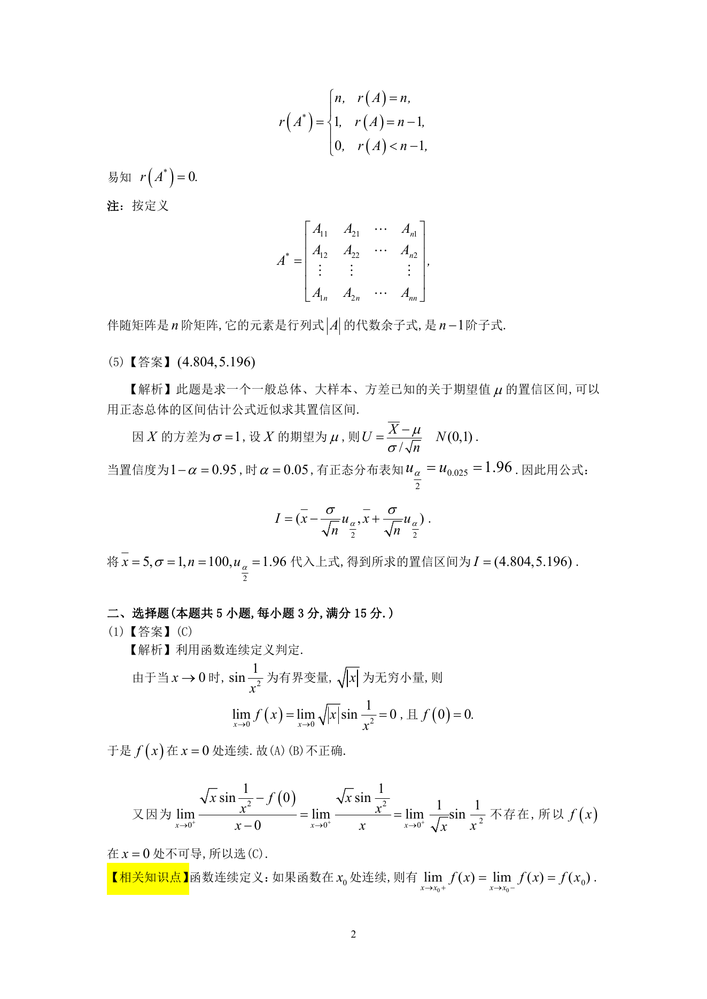
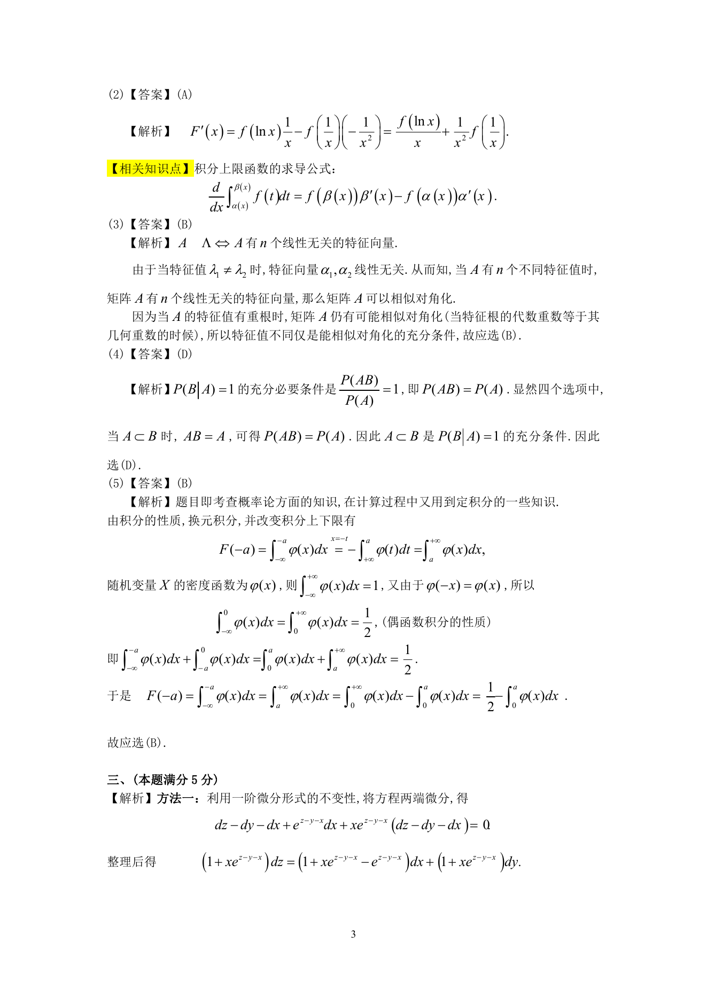

# 1993 数学三第 8 题

## 题目

$n$阶方阵$A$具有$n$个不同的特征值是$A$与对角阵相似的（ ）

A. 充分必要条件．

B. 充分而非必要条件．

C. 必要而非充分条件．

D. 既非充分也非必要条件．

## 标准答案

B

## 解析

答案为 B。解析见下方答案解析页图；PDF 文本层公式不稳定，未直接转写为 LaTeX。

## 答案解析页图

## 来源

- 题目来源：1993 年数学三 TeX 试卷源（试卷四）。
- 答案解析来源：1993年数学三真题答案解析.pdf。
- 页面图只作为原卷/解析复核依据；题干正文已按 TeX 源整理为 LaTeX。
