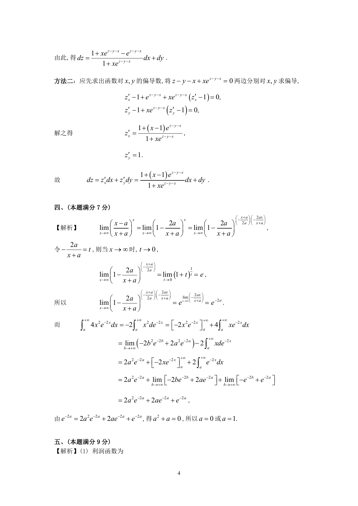

# 1993 数学三第 11 题

## 题目

设$z = f\left(x,y \right)$是由方程$z - y - x + x\mathrm{e}^{z - y - x} = 0$所确定的二元函数，求$\,\mathrm{d}z$．

## 标准答案

见答案解析页图

## 解析

解析见下方答案解析页图；PDF 文本层公式不稳定，未直接转写为 LaTeX。

## 答案解析页图

## 来源

- 题目来源：1993 年数学三 TeX 试卷源（试卷四）。
- 答案解析来源：1993年数学三真题答案解析.pdf。
- 页面图只作为原卷/解析复核依据；题干正文已按 TeX 源整理为 LaTeX。
