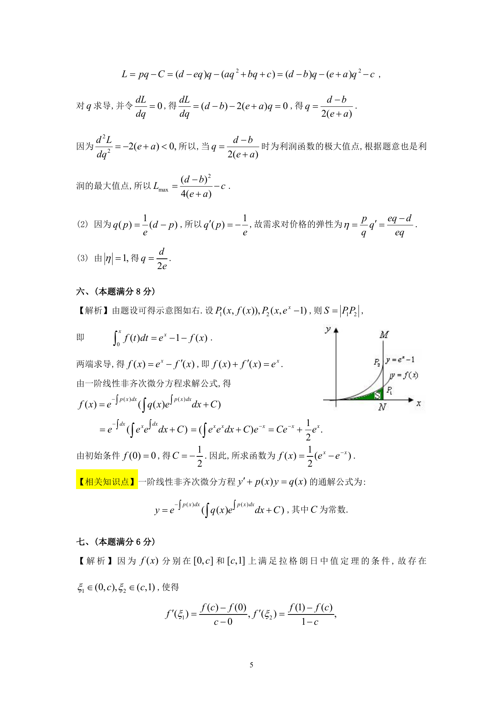

# 1993 数学三第 13 题

## 题目

设某产品的成本函数为$C = aq^2 + bq + c$，需求函数为$q = \frac{1}{e}(d - p)$，其中$C$为成本，
$q$为需求量（即产量），$p$为单价，$a$, $b$, $c$, $d$, $e$都是正的常数，且$d > b$，求：

1. 利润最大时的产量及最大利润；
2. 需求对价格的弹性；
3. 需求对价格弹性的绝对值为$1$时的产量．

## 标准答案

见答案解析页图

## 解析

解析见下方答案解析页图；PDF 文本层公式不稳定，未直接转写为 LaTeX。

## 答案解析页图

## 来源

- 题目来源：1993 年数学三 TeX 试卷源（试卷四）。
- 答案解析来源：1993年数学三真题答案解析.pdf。
- 页面图只作为原卷/解析复核依据；题干正文已按 TeX 源整理为 LaTeX。
