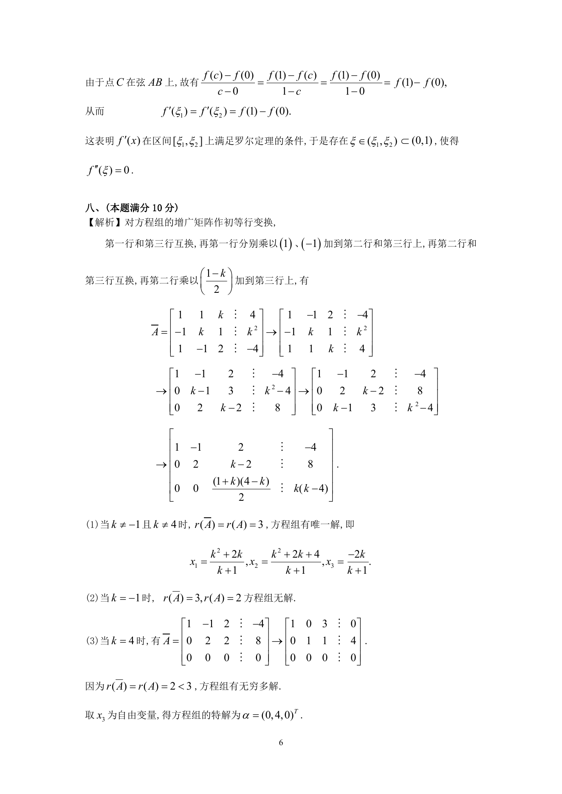
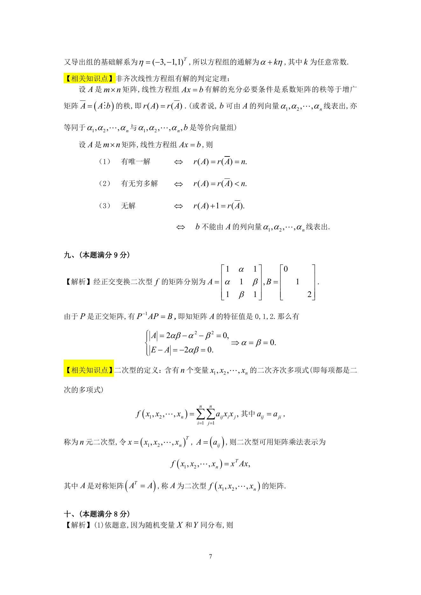

# 1993 数学三第 16 题

## 题目

$k$为何值时，线性方程组
$$\begin{cases}
x_1 + x_2 + kx_3 = 4, \\
-x_1 + kx_2 + x_3 = k^2, \\
x_1 - x_2 + 2x_3 = - 4
\end{cases}$$
有惟一解、无解、有无穷多组解？在有解情况下，求出其全部解．

## 标准答案

见答案解析页图

## 解析

解析见下方答案解析页图；PDF 文本层公式不稳定，未直接转写为 LaTeX。

## 答案解析页图

## 来源

- 题目来源：1993 年数学三 TeX 试卷源（试卷四）。
- 答案解析来源：1993年数学三真题答案解析.pdf。
- 页面图只作为原卷/解析复核依据；题干正文已按 TeX 源整理为 LaTeX。
