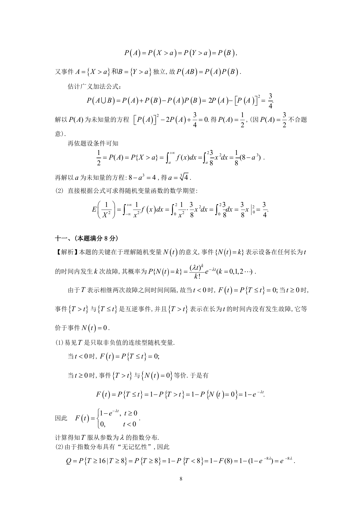

# 1993 数学三第 18 题

## 题目

设随机变量$X$和$Y$同分布，$X$的概率密度为
$$f(x) = \begin{cases}
\frac{3}{8}x^2, & 0 < x < 2, \\
0, & 其他.
\end{cases}$$

1. 已知事件$A = \{X > a\}$和$B = \{Y > a\}$独立，
且$P\left(A \cup B \right) = \frac{3}{4}$．求常数$a$．
2. 求$\frac{1}{X^2}$的数学期望．

## 标准答案

见答案解析页图

## 解析

解析见下方答案解析页图；PDF 文本层公式不稳定，未直接转写为 LaTeX。

## 答案解析页图

## 来源

- 题目来源：1993 年数学三 TeX 试卷源（试卷四）。
- 答案解析来源：1993年数学三真题答案解析.pdf。
- 页面图只作为原卷/解析复核依据；题干正文已按 TeX 源整理为 LaTeX。
