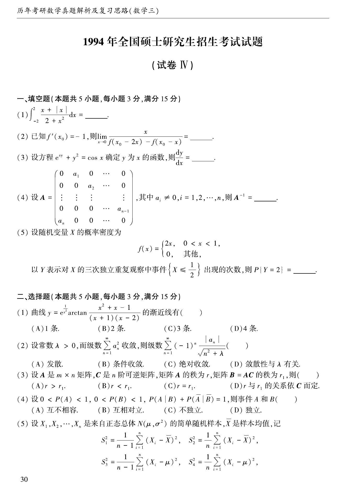
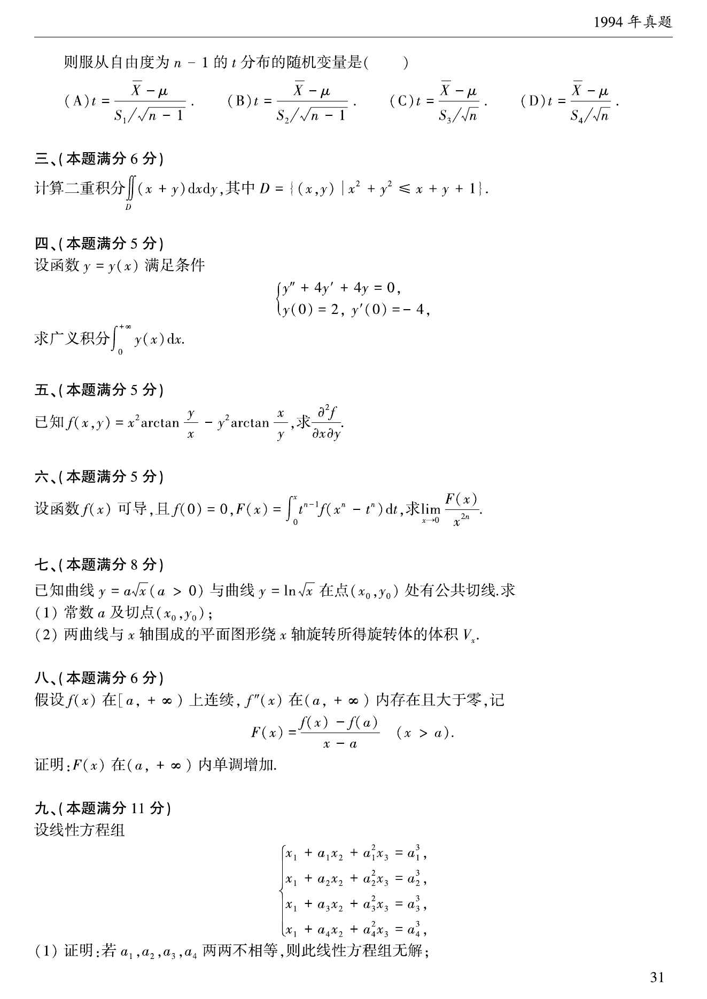
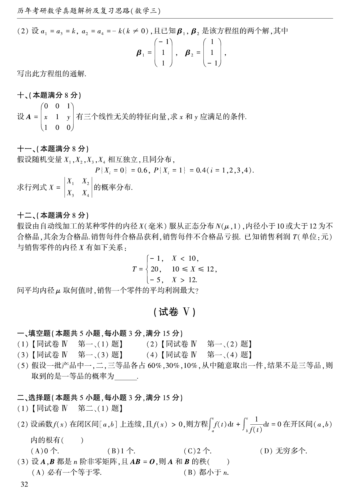
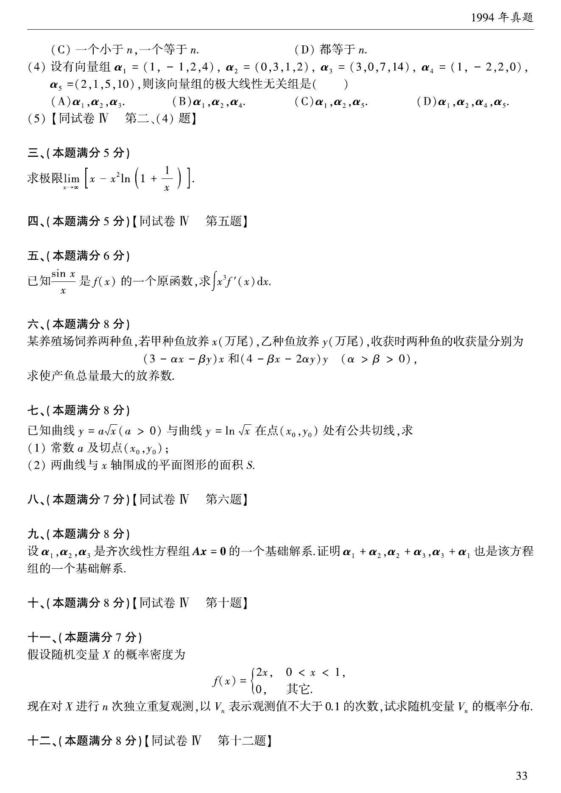

# 1994 年考研数学三真题

资料类型：考研数学三历年真题
年份：1994
科目：数学三
整理状态：TeX 题干源整理，答案解析 PDF 文本层拆分

## 原卷页图

## 填空题（本题共5小题，每小题3分，满分15分）

### 第 1 题

- 题型：填空题
- 题号：1
- 分值：3
- 模块：高等数学
- 校对状态：已按 TeX 源整理

$\int_{-2}^2\frac{x + |x|}{2 + x^2} \,\mathrm{d}x =$ ____．

### 第 2 题

- 题型：填空题
- 题号：2
- 分值：3
- 模块：高等数学
- 校对状态：已按 TeX 源整理

已知$f'(x) = - 1$，则$\lim_{x \to 0} \frac{x}{f(x_0 - 2x) - f(x_0 - x)} =$ ____．

### 第 3 题

- 题型：填空题
- 题号：3
- 分值：3
- 模块：高等数学
- 校对状态：已按 TeX 源整理

设方程$\mathrm{e}^{xy} + y^2 = \cos x$确定$y$为$x$的函数，则$\frac{\,\mathrm{d}y}{\,\mathrm{d}x} =$ ____．

### 第 4 题

- 题型：填空题
- 题号：4
- 分值：3
- 模块：高等数学
- 校对状态：已按 TeX 源整理

设$A = \begin{pmatrix}
0 & a_1 & 0 & \cdots & 0 \\
0 & 0 & a_2 & \cdots & 0 \\
\vdots & \vdots & \vdots & & \vdots \\
0 & 0 & 0 & \cdots & a_{n - 1} \\
a_n & 0 & 0 & \cdots & 0
\end{pmatrix}$，其中$a_i \ne 0,i = 1,2, \cdots ,n$，则$A^{-1} =$ ____．

### 第 5 题

- 题型：填空题
- 题号：5
- 分值：3
- 模块：概率统计
- 校对状态：已按 TeX 源整理

设随机变量$X$的概率密度为$f(x) = \begin{cases}
2x, & 0 < x < 1, \\
0, & 其他.
\end{cases}$
以$Y$表示对$X$的三次独立重复观察中事件$\left\{X \le \frac{1}{2} \right\}$出现的次数，
则$P\{Y = 2\} =$ ____．

## 选择题（本题共5小题，每小题3分，满分15分）

### 第 6 题

- 题型：选择题
- 题号：6
- 分值：3
- 模块：高等数学
- 校对状态：已按 TeX 源整理

曲线$y = \mathrm{e}^{\frac{1}{x^2}}\arctan \frac{x^2 + x + 1}{(x + 1)(x - 2)}$的渐近线有（ ）

A. 1条．

B. 2条．

C. 3条．

D. 4条．

### 第 7 题

- 题型：选择题
- 题号：7
- 分值：3
- 模块：高等数学
- 校对状态：已按 TeX 源整理

设常数$\lambda > 0$，且级数$\sum_{n = 1}^{\infty}a_n^2$收敛，则级数$\sum_{n = 1}^{\infty}(- 1)^n\frac{|a_n|}{\sqrt{n^2 + \lambda}}$（ ）

A. 发散．

B. 条件收敛．

C. 绝对收敛．

D. 收敛性与$\lambda$有关．

### 第 8 题

- 题型：选择题
- 题号：8
- 分值：3
- 模块：线性代数
- 校对状态：已按 TeX 源整理

设$A$是$m \times n$矩阵，$C$是$n$阶可逆矩阵，矩阵$A$的秩为$r$，矩阵$B = AC$的秩为$r_1$，则（ ）

A. $r > r_1$．

B. $r < r_1$．

C. $r = r_1$．

D. $r$与$r_1$的关系由$C$而定．

### 第 9 题

- 题型：选择题
- 题号：9
- 分值：3
- 模块：高等数学
- 校对状态：已按 TeX 源整理

设$0 < P(A) < 1$, $0 < P(B) < 1$, $P(\left. A \right|B) + P(\left. \bar A \right|\bar B) = 1$，则（ ）

A. 事件$A$和$B$互不相容．

B. 事件$A$和$B$相互对立．

C. 事件$A$和$B$互不独立．

D. 事件$A$和$B$相互独立．

### 第 10 题

- 题型：选择题
- 题号：10
- 分值：3
- 模块：概率统计
- 校对状态：已按 TeX 源整理

设$X_1,X_2, \cdots ,X_n$是来自正态总体$N(\mu ,\sigma^2)$的简单随机样本，$\overline{X}$是样本均值，记
\begin{align*}
S_1^2&= \frac{1}{n - 1}\sum_{i = 1}^n (X_i - \overline{X})^2, &
S_2^2&= \frac{1}{n}\sum_{i = 1}^n (X_i - \overline{X})^2, \\
S_3^2&= \frac{1}{n - 1}\sum_{i = 1}^n (X_i - \mu)^2, &
S_4^2&= \frac{1}{n}\sum_{i = 1}^n (X_i - \mu)^2,
\end{align*}
则服从自由度为$n - 1$的$t$分布的随机变量是（ ）

A. $t = \frac{\overline{X}- \mu}{S_1/\sqrt{n - 1}}$．

B. $t = \frac{\overline{X}- \mu}{S_2/\sqrt{n - 1}}$．

C. $t = \frac{\overline{X}- \mu}{S_3/\sqrt{n}}$

D. $t = \frac{\overline{X}- \mu}{S_4/\sqrt{n}}$．

## 第 3 部分（本题满分6分）

### 第 11 题

- 题型：解答题
- 题号：11
- 分值：6
- 模块：高等数学
- 校对状态：已按 TeX 源整理

计算二重积分$\iint_D (x + y)\,\mathrm{d}x\,\mathrm{d}y$，其中$D = \left\{\left. (x,y) \right| x^2 + y^2 \le x + y + 1 \right\}$．

## 第 4 部分（本题满分5分）

### 第 12 题

- 题型：解答题
- 题号：12
- 分值：5
- 模块：高等数学
- 校对状态：已按 TeX 源整理

设函数$y = y(x)$满足条件$\begin{cases}
y'' + 4y' + 4y = 0, \\
y(0) = 2,y'(0) = - 4, \\
\end{cases}$求广义积分$\int_0^{+\infty} y(x)\,\mathrm{d}x$．

## 第 5 部分（本题满分5分）

### 第 13 题

- 题型：解答题
- 题号：13
- 分值：5
- 模块：高等数学
- 校对状态：已按 TeX 源整理

已知$f(x,y) = x^2\arctan \frac{y}{x} - y^2\arctan \frac{x}{y}$，求$\frac{

tial^2 f}{

tialx

tial y}$．

## 第 6 部分（本题满分5分）

### 第 14 题

- 题型：解答题
- 题号：14
- 分值：5
- 模块：高等数学
- 校对状态：已按 TeX 源整理

设函数$f(x)$可导，且$f(0) = 0$, $F(x) = \int_0^x t^{n - 1} f(x^n - t^n)\,\mathrm{d}t$，求$\lim_{x \to 0} \frac{F(x)}{x^{2n}}$．

## 第 7 部分（本题满分8分）

### 第 15 题

- 题型：解答题
- 题号：15
- 分值：8
- 模块：高等数学
- 校对状态：已按 TeX 源整理

已知曲线$y = a\sqrt{x}$（$a > 0$）与曲线$y = \ln \sqrt{x}$在点$(x_0,y_0)$处有公共切线，求：

1. 常数$a$及切点$(x_0,y_0)$；
2. 两曲线与$x$轴围成的平面图形绕$x$轴旋转所得旋转体的体积$V_x$．

## 第 8 部分（本题满分6分）

### 第 16 题

- 题型：解答题
- 题号：16
- 分值：6
- 模块：高等数学
- 校对状态：已按 TeX 源整理

假设$f(x)$在$[a, +\infty)$上连续，$f''(x)$在$\left(a, +\infty \right)$内存在且大于零，记
$$F(x) = \frac{f(x) - f(a)}{x - a} (x > a),$$
证明$F(x)$在$\left(a, +\infty \right)$内单调增加．

## 第 9 部分（本题满分11分）

### 第 17 题

- 题型：解答题
- 题号：17
- 分值：11
- 模块：线性代数
- 校对状态：已按 TeX 源整理

设线性方程组$\begin{cases}
x_1 + a_1x_2 + a_1^2x_3 = a_1^3, \\
x_1 + a_2x_2 + a_2^2x_3 = a_2^3, \\
x_1 + a_3x_2 + a_3^2x_3 = a_3^3, \\
x_1 + a_4x_2 + a_4^2x_3 = a_4^3. \\
\end{cases}$

1. 证明：若$a_1,a_2,a_3,a_4$两两不相等，则此线性方程组无解；
2. 设$a_1 = a_3 = k$, $a_2 = a_4 = - k$（$k \ne 0$），
且已知$\beta_1$, $\beta_2$是该方程组的两个解，其中
$$\beta_1 = \begin{pmatrix}
-1 \\
1 \\
1
\end{pmatrix},\beta_2 = \begin{pmatrix}
1 \\
1 \\
-1
\end{pmatrix},$$
写出此方程组的通解．

## 第 10 部分（本题满分8分）

### 第 18 题

- 题型：解答题
- 题号：18
- 分值：8
- 模块：线性代数
- 校对状态：已按 TeX 源整理

设$A = \begin{pmatrix}
0 & 0 & 1 \\
x & 1 & y \\
1 & 0 & 0
\end{pmatrix}$有三个线性无关的特征向量，求$x$和$y$应满足的条件．

## 第 11 部分（本题满分8分）

### 第 19 题

- 题型：解答题
- 题号：19
- 分值：8
- 模块：概率统计
- 校对状态：已按 TeX 源整理

假设随机变量$X_1,X_2,X_3,X_4$相互独立，且同分布
$$P\left\{X_i = 0 \right\} = 0.6, P\left\{X_i = 1 \right\} = 0, (i = 1,2,3,4).$$
求行列式$X = \begin{vmatrix}
X_1 & X_2 \\
X_3 & X_4
\end{vmatrix}$的概率分布．

## 第 12 部分（本题满分8分）

### 第 20 题

- 题型：解答题
- 题号：20
- 分值：8
- 模块：概率统计
- 校对状态：已按 TeX 源整理

假设由自动线加工的某种零件的内径$X$(毫米)服从正态分布$N(\mu ,1)$，内径小于$10$ 或大于$12$的为不合格品，其余为合格品，销售每件合格品获利，销售每件不合格品亏损．已知销售利润$T$(单位:元)与销售零件的内径$X$有如下关系:
$$T = \begin{cases}
-1, & X < 10, \\
20, & 10 \le X \le 12, \\
-5, & X > 12.
\end{cases}$$
问平均内径$\mu$取何值时，销售一个零件的平均利润最大?
