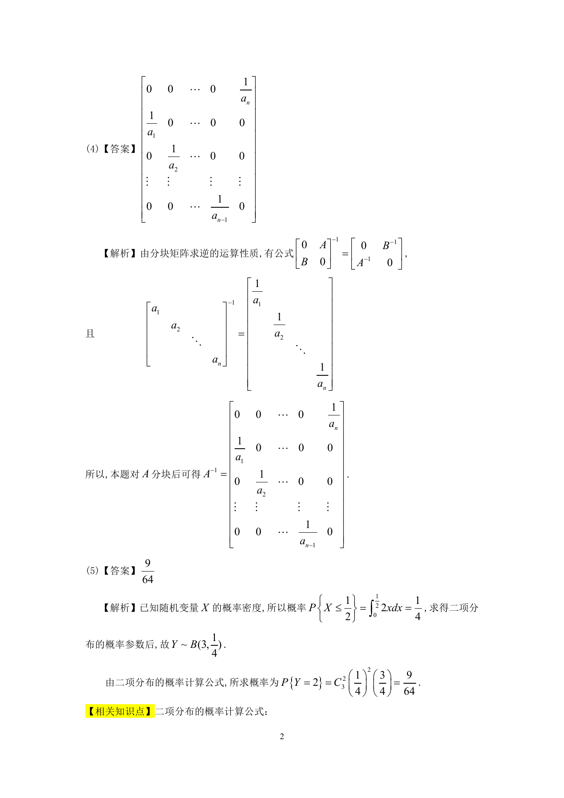

# 1994 数学三第 3 题

## 题目

设方程$\mathrm{e}^{xy} + y^2 = \cos x$确定$y$为$x$的函数，则$\frac{\,\mathrm{d}y}{\,\mathrm{d}x} =$ ____．

## 标准答案

见答案解析页图

## 解析

该题答案见下方答案解析页图；PDF 文本层顺序和公式不稳定，未直接转写为标准 LaTeX 文本。

## 答案解析页图

## 来源

- 题目来源：1994 年数学三 TeX 试卷源（试卷四）。
- 答案解析来源：1994年数学三真题答案解析.pdf。
- 页面图只作为原卷/解析复核依据；题干正文已按 TeX 源整理为 LaTeX。
