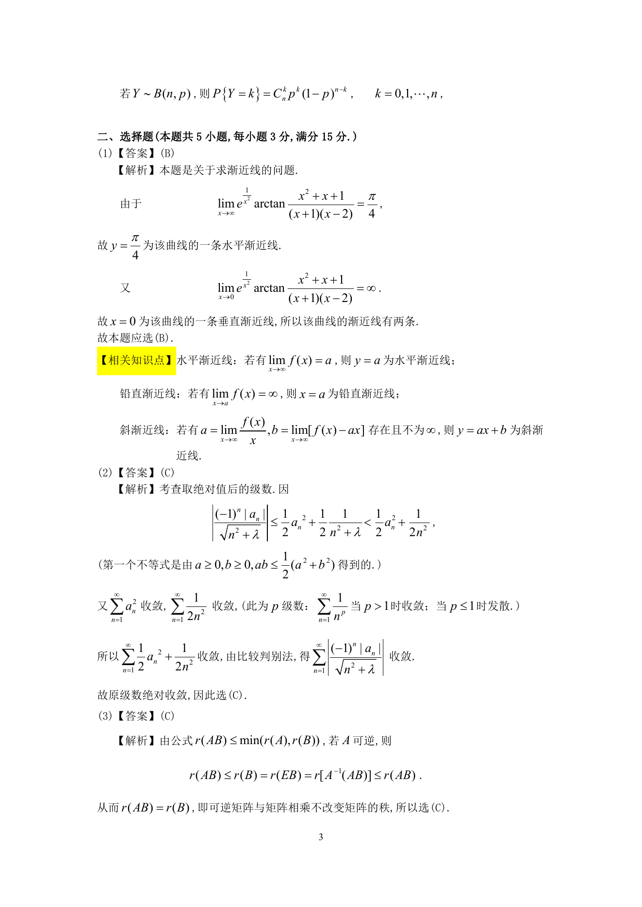

# 1994 数学三第 5 题

## 题目

设随机变量$X$的概率密度为$f(x) = \begin{cases}
2x, & 0 < x < 1, \\
0, & 其他.
\end{cases}$
以$Y$表示对$X$的三次独立重复观察中事件$\left\{X \le \frac{1}{2} \right\}$出现的次数，
则$P\{Y = 2\} =$ \underline{\qquad}．

## 标准答案

见答案解析页图

## 解析

该题答案见下方答案解析页图；PDF 文本层顺序和公式不稳定，未直接转写为标准 LaTeX 文本。

## 答案解析页图

## 来源

- 题目来源：1994 年数学三 TeX 试卷源（试卷四）。
- 答案解析来源：1994年数学三真题答案解析.pdf。
- 页面图只作为原卷/解析复核依据；题干正文已按 TeX 源整理为 LaTeX。
