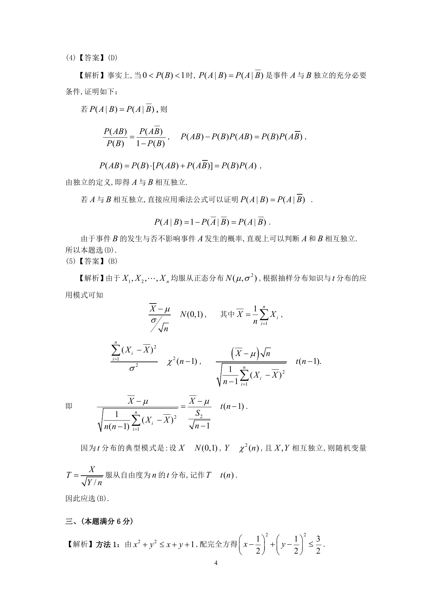

# 1994 数学三第 8 题

## 题目

设$A$是$m \times n$矩阵，$C$是$n$阶可逆矩阵，矩阵$A$的秩为$r$，矩阵$B = AC$的秩为$r_1$，则（ ）

A. $r > r_1$．

B. $r < r_1$．

C. $r = r_1$．

D. $r$与$r_1$的关系由$C$而定．

## 标准答案

C

## 解析

答案为 C。解析见下方答案解析页图；PDF 文本层公式不稳定，未直接转写为 LaTeX。

## 答案解析页图

## 来源

- 题目来源：1994 年数学三 TeX 试卷源（试卷四）。
- 答案解析来源：1994年数学三真题答案解析.pdf。
- 页面图只作为原卷/解析复核依据；题干正文已按 TeX 源整理为 LaTeX。
