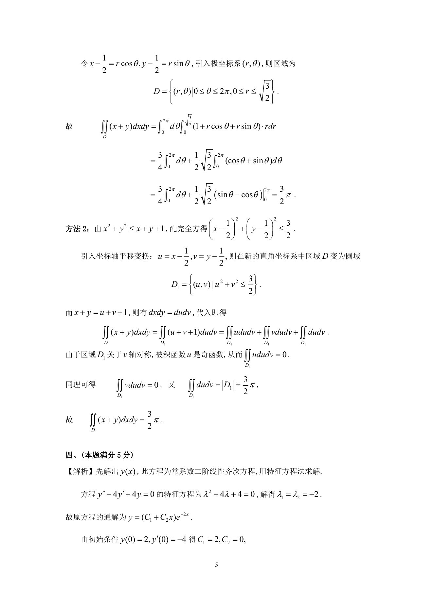

# 1994 数学三第 12 题

## 题目

设函数$y = y(x)$满足条件$\begin{cases}
y'' + 4y' + 4y = 0, \\
y(0) = 2,y'(0) = - 4, \\
\end{cases}$求广义积分$\int_0^{+\infty} y(x)\,\mathrm{d}x$．

## 标准答案

见答案解析页图

## 解析

解析见下方答案解析页图；PDF 文本层公式不稳定，未直接转写为 LaTeX。

## 答案解析页图

## 来源

- 题目来源：1994 年数学三 TeX 试卷源（试卷四）。
- 答案解析来源：1994年数学三真题答案解析.pdf。
- 页面图只作为原卷/解析复核依据；题干正文已按 TeX 源整理为 LaTeX。
