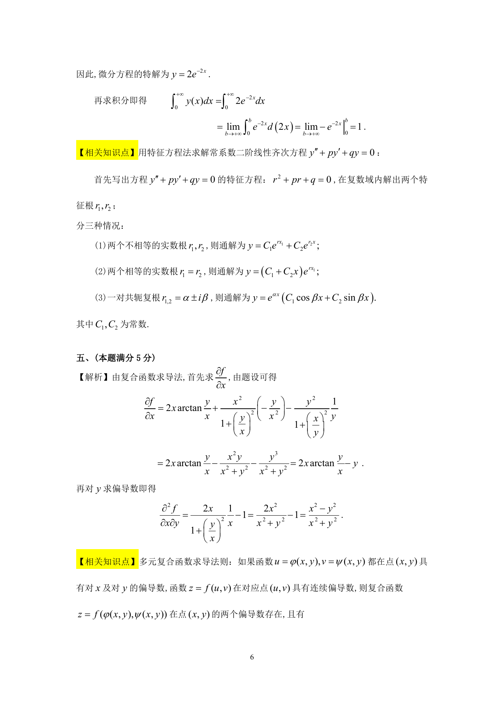
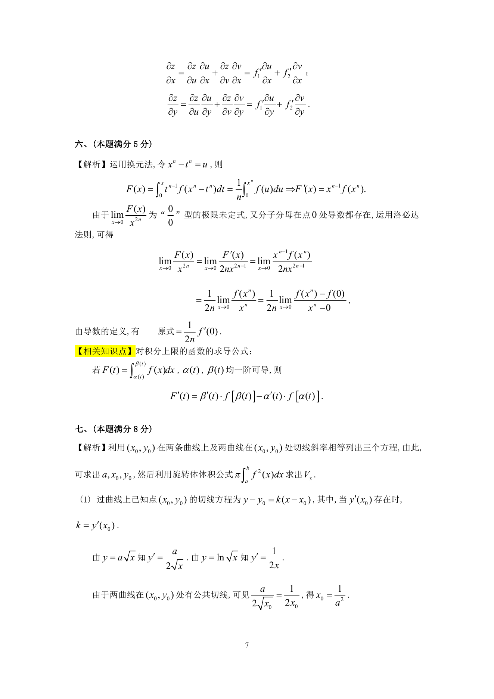

# 1994 数学三第 13 题

## 题目

已知$f(x,y) = x^2\arctan \frac{y}{x} - y^2\arctan \frac{x}{y}$，求$\frac{

tial^2 f}{

tialx

tial y}$．

## 标准答案

见答案解析页图

## 解析

解析见下方答案解析页图；PDF 文本层公式不稳定，未直接转写为 LaTeX。

## 答案解析页图

## 来源

- 题目来源：1994 年数学三 TeX 试卷源（试卷四）。
- 答案解析来源：1994年数学三真题答案解析.pdf。
- 页面图只作为原卷/解析复核依据；题干正文已按 TeX 源整理为 LaTeX。
