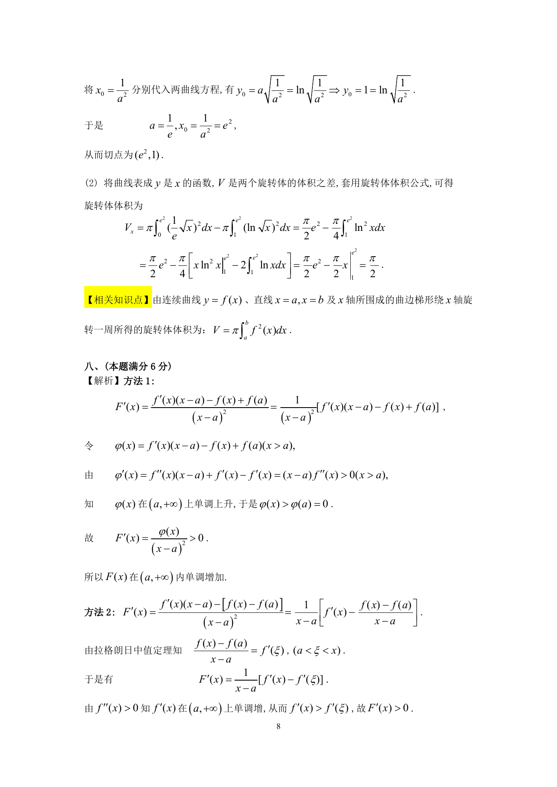

# 1994 数学三第 16 题

## 题目

假设$f(x)$在$[a, +\infty)$上连续，$f''(x)$在$\left(a, +\infty \right)$内存在且大于零，记
$$F(x) = \frac{f(x) - f(a)}{x - a} (x > a),$$
证明$F(x)$在$\left(a, +\infty \right)$内单调增加．

## 标准答案

见答案解析页图

## 解析

解析见下方答案解析页图；PDF 文本层公式不稳定，未直接转写为 LaTeX。

## 答案解析页图

## 来源

- 题目来源：1994 年数学三 TeX 试卷源（试卷四）。
- 答案解析来源：1994年数学三真题答案解析.pdf。
- 页面图只作为原卷/解析复核依据；题干正文已按 TeX 源整理为 LaTeX。
