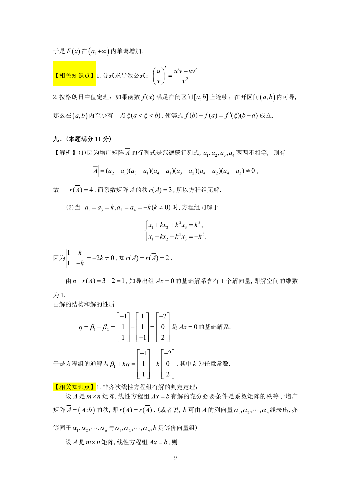
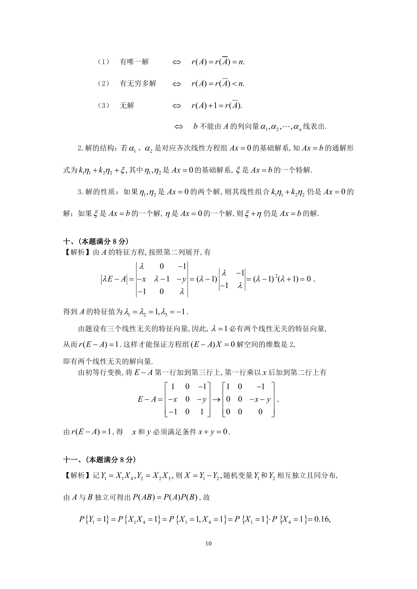

# 1994 数学三第 17 题

## 题目

设线性方程组$\begin{cases}
x_1 + a_1x_2 + a_1^2x_3 = a_1^3, \\
x_1 + a_2x_2 + a_2^2x_3 = a_2^3, \\
x_1 + a_3x_2 + a_3^2x_3 = a_3^3, \\
x_1 + a_4x_2 + a_4^2x_3 = a_4^3. \\
\end{cases}$

1. 证明：若$a_1,a_2,a_3,a_4$两两不相等，则此线性方程组无解；
2. 设$a_1 = a_3 = k$, $a_2 = a_4 = - k$（$k \ne 0$），
且已知$\beta_1$, $\beta_2$是该方程组的两个解，其中
$$\beta_1 = \begin{pmatrix}
-1 \\
1 \\
1
\end{pmatrix},\beta_2 = \begin{pmatrix}
1 \\
1 \\
-1
\end{pmatrix},$$
写出此方程组的通解．

## 标准答案

见答案解析页图

## 解析

解析见下方答案解析页图；PDF 文本层公式不稳定，未直接转写为 LaTeX。

## 答案解析页图

## 来源

- 题目来源：1994 年数学三 TeX 试卷源（试卷四）。
- 答案解析来源：1994年数学三真题答案解析.pdf。
- 页面图只作为原卷/解析复核依据；题干正文已按 TeX 源整理为 LaTeX。
