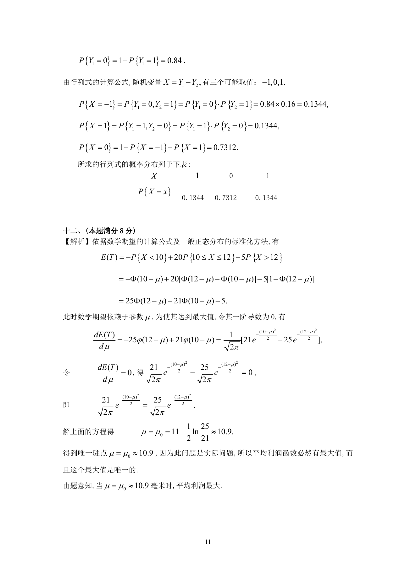

# 1994 数学三第 19 题

## 题目

假设随机变量$X_1,X_2,X_3,X_4$相互独立，且同分布
$$P\left\{X_i = 0 \right\} = 0.6, P\left\{X_i = 1 \right\} = 0, (i = 1,2,3,4).$$
求行列式$X = \begin{vmatrix}
X_1 & X_2 \\
X_3 & X_4
\end{vmatrix}$的概率分布．

## 标准答案

见答案解析页图

## 解析

解析见下方答案解析页图；PDF 文本层公式不稳定，未直接转写为 LaTeX。

## 答案解析页图

## 来源

- 题目来源：1994 年数学三 TeX 试卷源（试卷四）。
- 答案解析来源：1994年数学三真题答案解析.pdf。
- 页面图只作为原卷/解析复核依据；题干正文已按 TeX 源整理为 LaTeX。
