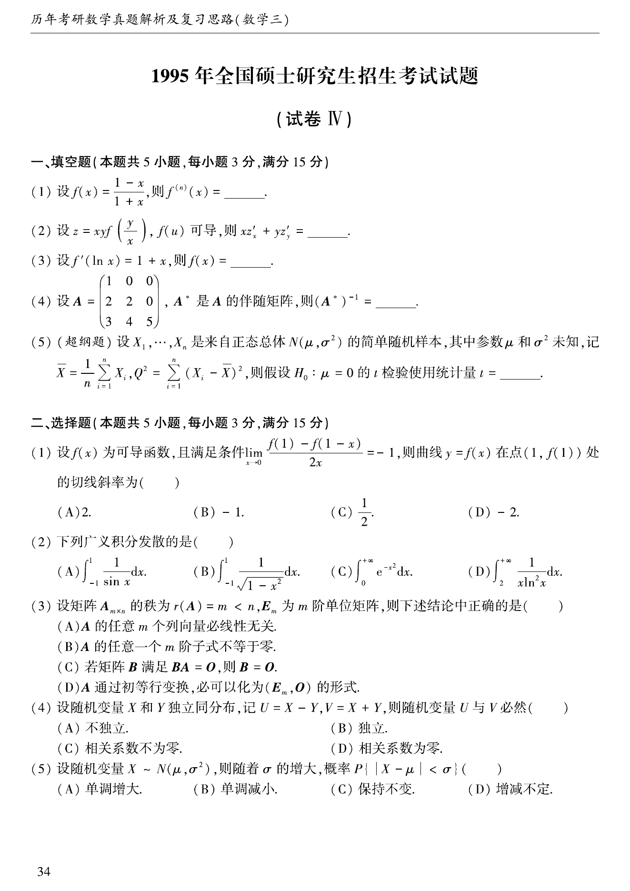
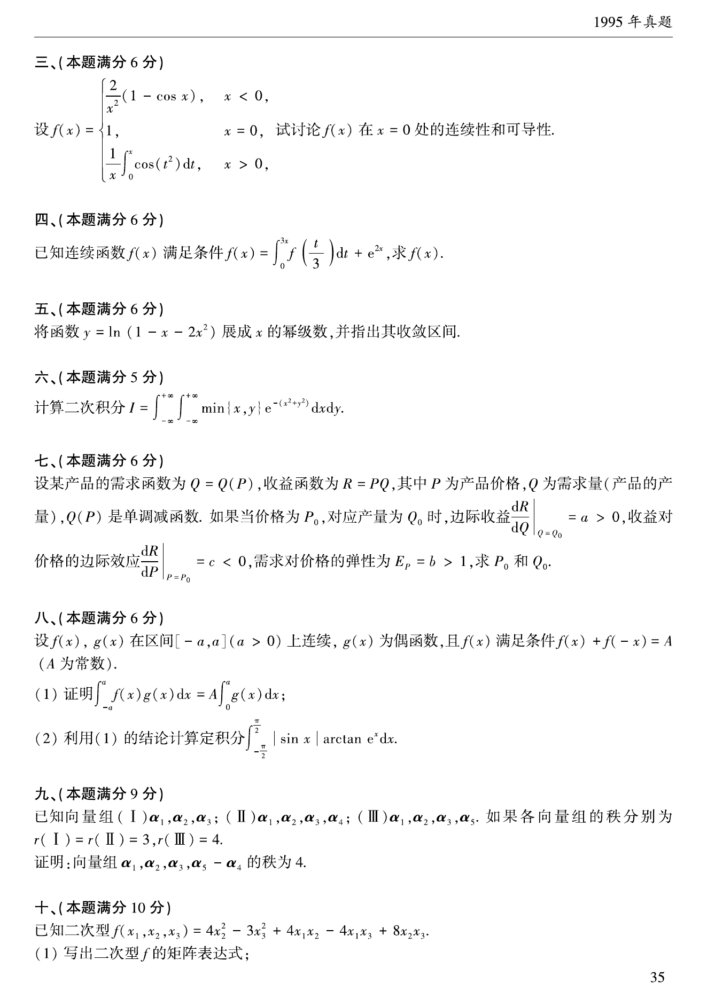
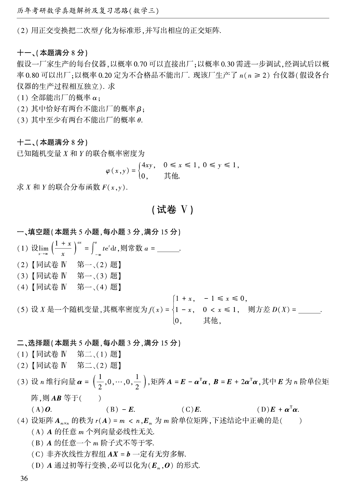
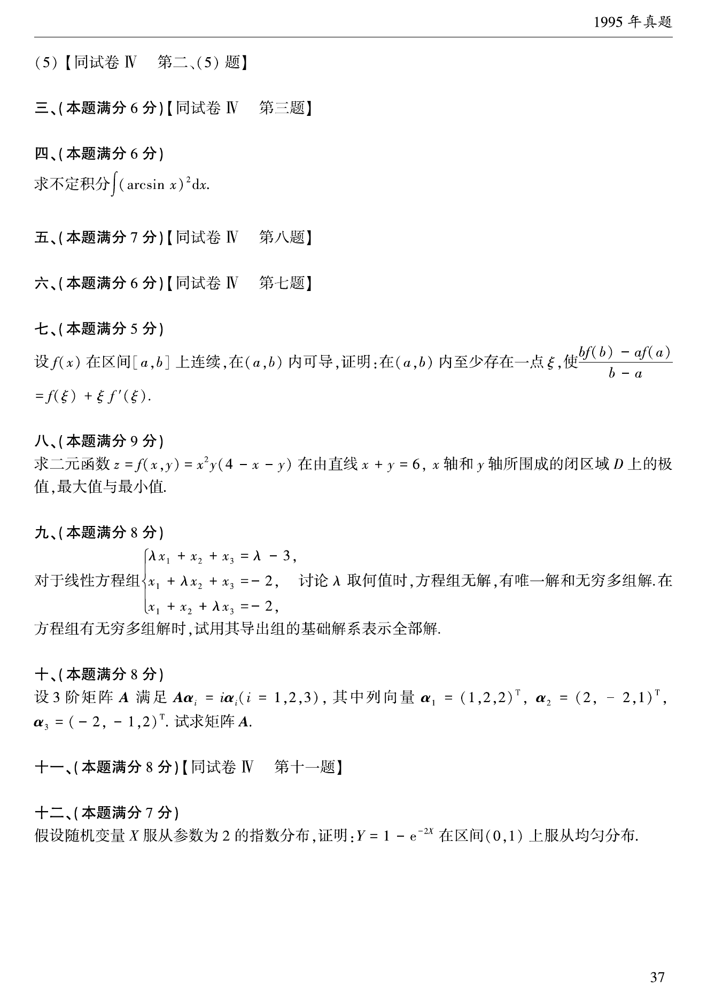

# 1995 年考研数学三真题

资料类型：考研数学三历年真题
年份：1995
科目：数学三
整理状态：TeX 题干源整理，答案解析 PDF 文本层拆分

## 原卷页图

## 填空题（本题共5小题，每小题3分，满分15分）

### 第 1 题

- 题型：填空题
- 题号：1
- 分值：3
- 模块：高等数学
- 校对状态：已按 TeX 源整理

设$f(x) = \frac{1 - x}{1 + x}$，则$f^{(n)}(x) =$ ____．

### 第 2 题

- 题型：填空题
- 题号：2
- 分值：3
- 模块：高等数学
- 校对状态：已按 TeX 源整理

设$z = xyf\left(\frac{y}{x} \right)$,$f(u)$可导，则$xz'_x + yz'_y =$ ____．

### 第 3 题

- 题型：填空题
- 题号：3
- 分值：3
- 模块：高等数学
- 校对状态：已按 TeX 源整理

设$f'(\ln x) = 1 + x$，则$f(x) =$ ____．

### 第 4 题

- 题型：填空题
- 题号：4
- 分值：3
- 模块：线性代数
- 校对状态：已按 TeX 源整理

设$A = \begin{pmatrix}
1 & 0 & 0 \\
2 & 2 & 0 \\
3 & 4 & 5
\end{pmatrix}$，$A^*$是$A$的伴随矩阵，则$(A^*)^{-1} =$ ____．

### 第 5 题

- 题型：填空题
- 题号：5
- 分值：3
- 模块：概率统计
- 校对状态：已按 TeX 源整理

设$X_1,X_2, \cdots ,X_n$是来自正态总体$N(\mu ,\sigma^2)$的简单随机样本，其中参数$\mu$和$\sigma^2$未知，
记$\overline{X}= \frac{1}{n}\sum_{i = 1}^n X_i^{}$，
$Q^2 = \sum_{i = 1}^n (X_i^{} - \overline{X})^2$，
则假设$H_0:\mu = 0$的$t$检验使用统计量$t =$ ____．

## 选择题（本题共5小题，每小题3分，满分15分）

### 第 6 题

- 题型：选择题
- 题号：6
- 分值：3
- 模块：高等数学
- 校对状态：已按 TeX 源整理

设$f(x)$为可导函数，且满足条件$\lim_{x \to 0} \frac{f(1) - f(1 - x)}{2x} = - 1$,
则曲线$y = f(x)$在点$(1,f(1))$处的切线斜率为（ ）

A. $2$．

B. $- 1$．

C. $\frac{1}{2}$．

D. $- 2$．

### 第 7 题

- 题型：选择题
- 题号：7
- 分值：3
- 模块：高等数学
- 校对状态：已按 TeX 源整理

下列广义积分发散的是（ ）

A. $\int_{-1}^1\frac{1}{\sin x}\,\mathrm{d}x$．

B. $\int_{-1}^1\frac{1}{\sqrt{1 - x^2}}\,\mathrm{d}x$．

C. $\int_0^{+\infty} \mathrm{e}^{- x^2} \,\mathrm{d}x$．

D. $\int_2^{+\infty} \frac{1}{x\ln^2 x} \,\mathrm{d}x$．

### 第 8 题

- 题型：选择题
- 题号：8
- 分值：3
- 模块：线性代数
- 校对状态：已按 TeX 源整理

设矩阵$A_{m \times n}$的秩为$r(A) = m < n$,$E_m$为$m$阶单位矩阵，下述结论中正确的是（ ）

A. $A$的任意$m$个行向量必线性无关．

B. $A$的任意一个$m$阶子式不等于零．

C. 若矩阵$B$满足$BA = 0$，则$B = 0$．

D. $A$通过初等行变换，必可以化为$(E_m,0)$的形式．

### 第 9 题

- 题型：选择题
- 题号：9
- 分值：3
- 模块：概率统计
- 校对状态：已按 TeX 源整理

设随机变量$X$和$Y$独立同分布，记$U = X - Y,V = X + Y$，则随机变量$U$与$V$必然（ ）

A. 不独立．

B. 独立．

C. 相关系数不为零．

D. 相关系数为零．

### 第 10 题

- 题型：选择题
- 题号：10
- 分值：3
- 模块：概率统计
- 校对状态：已按 TeX 源整理

设随机变量$X$服从正态分布$N(\mu,\sigma^2)$，则随$\sigma$的增大，
概率$P\left\{\left| X - \mu \right| < \sigma \right\}$（ ）

A. 单调增大．

B. 单调减少．

C. 保持不变．

D. 增减不定．

## 第 3 部分（本题满分6分）

### 第 11 题

- 题型：解答题
- 题号：11
- 分值：6
- 模块：高等数学
- 校对状态：已按 TeX 源整理

设$f(x) = \begin{cases}
\frac{2}{x^2}(1 - \cos x), & x < 0 \\
1, & x = 0 \\
\frac{1}{x}\int_0^x \cos t^2 \,\mathrm{d}t , & x > 0
\end{cases}$，试讨论$f(x)$在$x = 0$处的连续性和可导性．

## 第 4 部分（本题满分6分）

### 第 12 题

- 题型：解答题
- 题号：12
- 分值：6
- 模块：高等数学
- 校对状态：已按 TeX 源整理

已知连续函数$f(x)$满足条件$f(x) = \int_0^{3x} f\left(\frac{t}{3} \right) \,\mathrm{d}t + \mathrm{e}^{2x}$，求$f(x)$．

## 第 5 部分（本题满分6分）

### 第 13 题

- 题型：解答题
- 题号：13
- 分值：6
- 模块：高等数学
- 校对状态：已按 TeX 源整理

将函数$y = \ln(1 - x - 2x^2)$展成$x$的幂级数，并指出其收敛区间．

## 第 6 部分（本题满分5分）

### 第 14 题

- 题型：解答题
- 题号：14
- 分值：5
- 模块：高等数学
- 校对状态：已按 TeX 源整理

计算$\int_{-\infty}^{+\infty} \int_{-\infty}^{+\infty} \min \{x,y\} \mathrm{e}^{- (x^2 + y^2)} \,\mathrm{d}x\,\mathrm{d}y$．

## 第 7 部分（本题满分6分）

### 第 15 题

- 题型：解答题
- 题号：15
- 分值：6
- 模块：高等数学
- 校对状态：已按 TeX 源整理

设某产品的需求函数为$Q = Q(P)$，收益函数为$R = PQ$，其中$P$为产品价格，$Q$为需求量(产品的产量),
$Q(P)$为单调减函数．如果当价格为$P_0$，对应产量为$Q_0$时，边际收益$\left. \frac{\mathrm{d} R}{\mathrm{d} Q} \right|_{Q = Q_0} = a > 0$,
收益对价格的边际效应$\left. \frac{\mathrm{d} R}{\mathrm{d} P} \right|_{P = P_0} = c < 0$,
需求对价格的弹性$E_P = b > 1$．求$P_0$和$Q_0$．

## 第 8 部分（本题满分6分）

### 第 16 题

- 题型：解答题
- 题号：16
- 分值：6
- 模块：高等数学
- 校对状态：已按 TeX 源整理

设$f(x)$, $g(x)$在区间$[- a,a]$($a > 0$)上连续，$g(x)$为偶函数，
且$f(x)$满足条件$f(x) + f(- x) = A$（$A$为常数）．

1. 证明$\int_{- a}^a f(x)g(x)\,\mathrm{d}x = A\int_0^a g(x)\,\mathrm{d}x$；
2. 利用(I)的结论计算定积分$\int_{-\frac{\pi}{2}}^{\frac{\pi}{2}}|\sin x|\arctan\mathrm{e}^x\,\mathrm{d}x$．

## 第 9 部分（本题满分9分）

### 第 17 题

- 题型：解答题
- 题号：17
- 分值：9
- 模块：线性代数
- 校对状态：已按 TeX 源整理

已知向量组(I) $\alpha_1,\alpha_2,\alpha_3$；(II) $\alpha_1,\alpha_2,\alpha_3,\alpha_4$；
(III) $\alpha_1,\alpha_2,\alpha_3,\alpha_5$．
如果各向量组的秩分别为$r(\textrm{I}) = r(\textrm{II}) = 3$, $r(\textrm{III}) = 4$，
证明:向量组$\alpha_1,\alpha_2,\alpha_3,\alpha_5 - \alpha_4$的秩为4.

## 第 10 部分（本题满分10分）

### 第 18 题

- 题型：解答题
- 题号：18
- 分值：10
- 模块：线性代数
- 校对状态：已按 TeX 源整理

已知二次型$f(x_1,x_2,x_3) = 4x_2^2- 3x_3^2+ 4x_1x_2 - 4x_1x_3 + 8x_2x_3$．

1. 写出二次型$f$的矩阵表达式；
2. 用正交变换把二次型$f$化为标准形，并写出相应的正交矩阵．

## 第 11 部分（本题满分8分）

### 第 19 题

- 题型：解答题
- 题号：19
- 分值：8
- 模块：概率统计
- 校对状态：已按 TeX 源整理

假设一厂家生产的每台仪器，以概率$0.70$可以直接出厂；
以概率$0.30$需进一步调试，经调试后以概率$0.80$可以出厂；以概率$0.20$定为不合格品不能出厂．
现该厂新生产了$n$（$n \ge 2$）台仪器（假设各台仪器的生产过程相互独立）．求：

1. 全部能出厂的概率$\alpha$；
2. 其中恰好有两台不能出厂的概率$\beta$；
3. 其中至少有两台不能出厂的概率$\theta$．

## 第 12 部分（本题满分8分）

### 第 20 题

- 题型：解答题
- 题号：20
- 分值：8
- 模块：概率统计
- 校对状态：已按 TeX 源整理

已知随机变量$X$和$Y$的联合概率密度为
$$f(x,y) = \begin{cases}
4xy, & 0 \le x \le 1,0 \le y \le 1, \\
0, & 其他,
\end{cases}$$
求$X$和$Y$联合分布函数$F(x,y)$．
