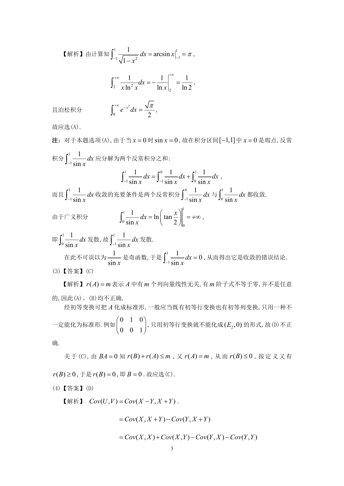
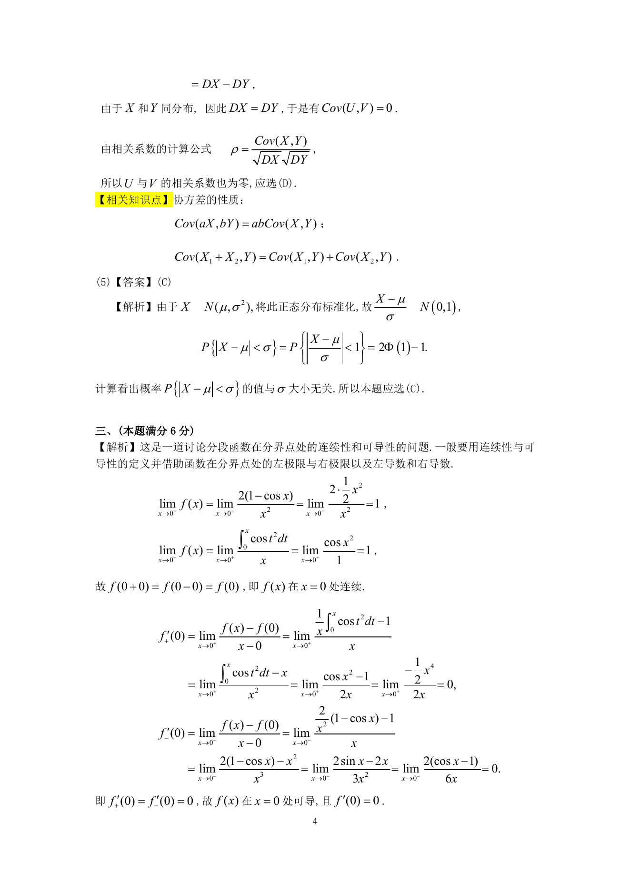

# 1995 数学三第 9 题

## 题目

设随机变量$X$和$Y$独立同分布，记$U = X - Y,V = X + Y$，则随机变量$U$与$V$必然（ ）

A. 不独立．

B. 独立．

C. 相关系数不为零．

D. 相关系数为零．

## 标准答案

D

## 解析

答案为 D。解析见下方答案解析页图；PDF 文本层公式不稳定，未直接转写为 LaTeX。

## 答案解析页图

## 来源

- 题目来源：1995 年数学三 TeX 试卷源（试卷四）。
- 答案解析来源：1995年数学三真题答案解析.pdf。
- 页面图只作为原卷/解析复核依据；题干正文已按 TeX 源整理为 LaTeX。
