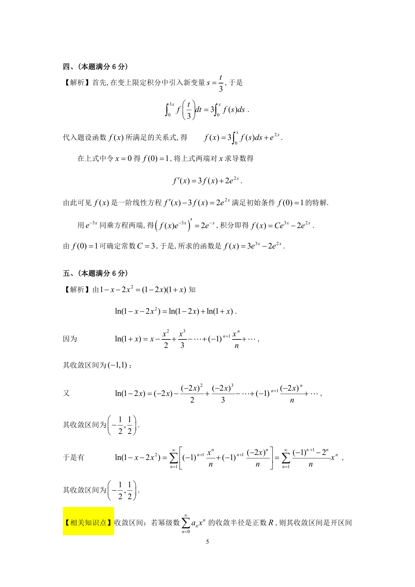

# 1995 数学三第 12 题

## 题目

已知连续函数$f(x)$满足条件$f(x) = \int_0^{3x} f\left(\frac{t}{3} \right) \,\mathrm{d}t + \mathrm{e}^{2x}$，求$f(x)$．

## 标准答案

见答案解析页图

## 解析

解析见下方答案解析页图；PDF 文本层公式不稳定，未直接转写为 LaTeX。

## 答案解析页图

## 来源

- 题目来源：1995 年数学三 TeX 试卷源（试卷四）。
- 答案解析来源：1995年数学三真题答案解析.pdf。
- 页面图只作为原卷/解析复核依据；题干正文已按 TeX 源整理为 LaTeX。
