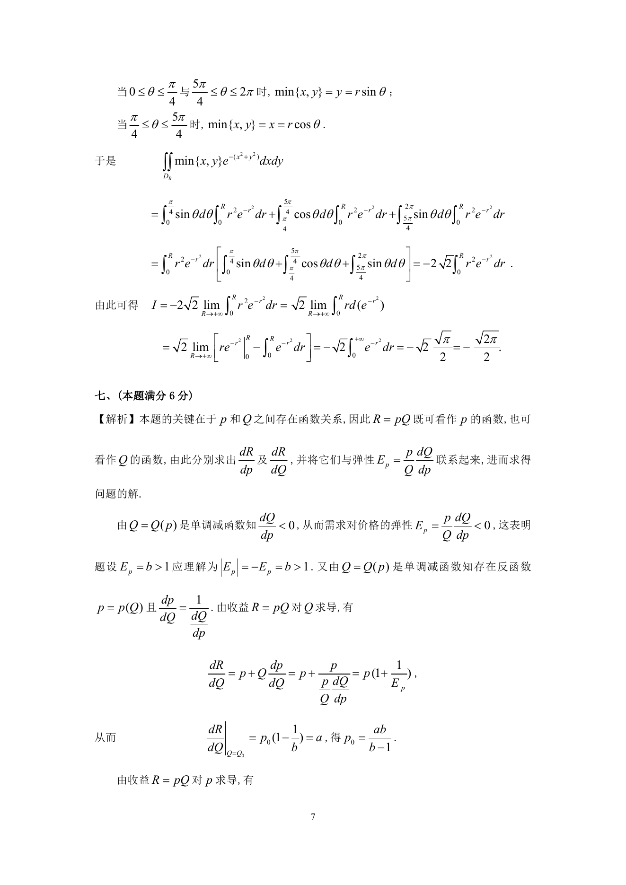
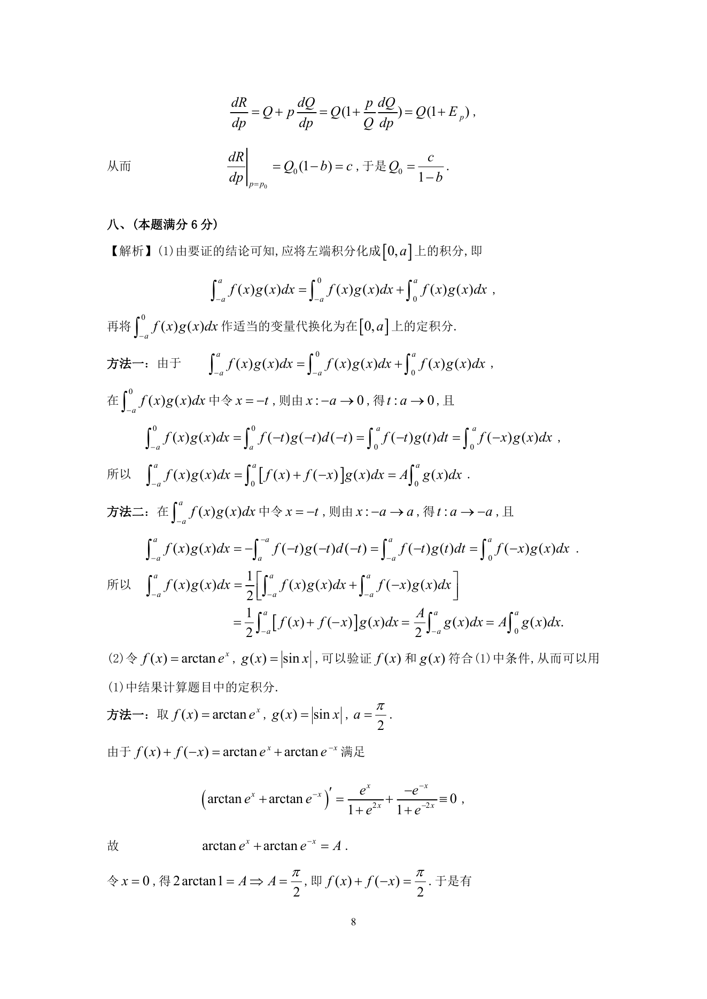

# 1995 数学三第 15 题

## 题目

设某产品的需求函数为$Q = Q(P)$，收益函数为$R = PQ$，其中$P$为产品价格，$Q$为需求量(产品的产量),
$Q(P)$为单调减函数．如果当价格为$P_0$，对应产量为$Q_0$时，边际收益$\left. \frac{\mathrm{d} R}{\mathrm{d} Q} \right|_{Q = Q_0} = a > 0$,
收益对价格的边际效应$\left. \frac{\mathrm{d} R}{\mathrm{d} P} \right|_{P = P_0} = c < 0$,
需求对价格的弹性$E_P = b > 1$．求$P_0$和$Q_0$．

## 标准答案

见答案解析页图

## 解析

解析见下方答案解析页图；PDF 文本层公式不稳定，未直接转写为 LaTeX。

## 答案解析页图

## 来源

- 题目来源：1995 年数学三 TeX 试卷源（试卷四）。
- 答案解析来源：1995年数学三真题答案解析.pdf。
- 页面图只作为原卷/解析复核依据；题干正文已按 TeX 源整理为 LaTeX。
