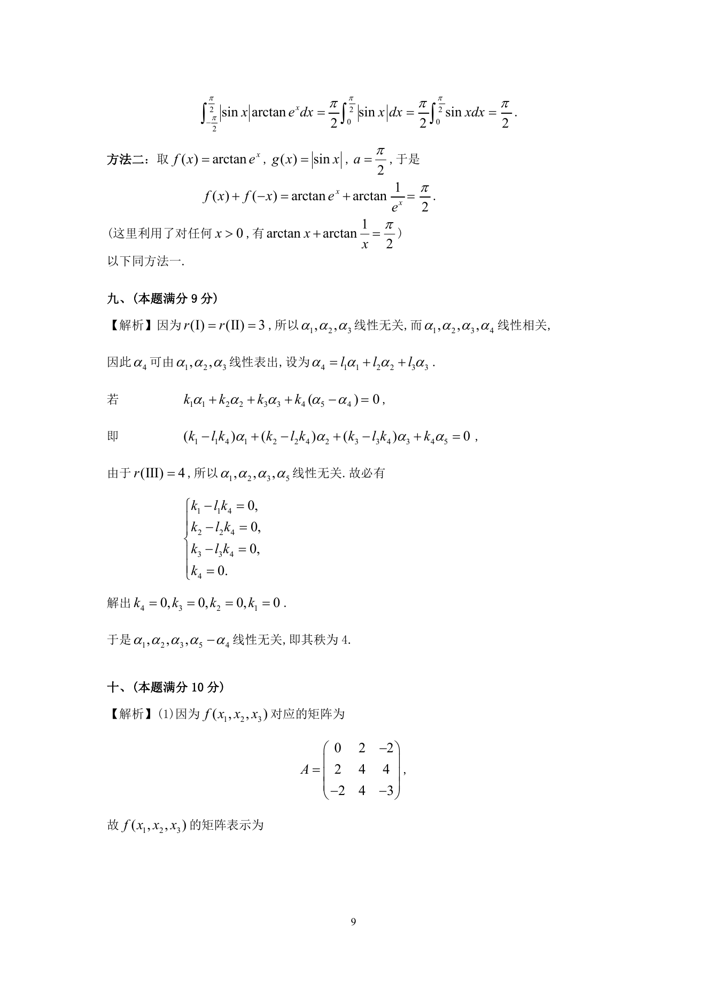

# 1995 数学三第 16 题

## 题目

设$f(x)$, $g(x)$在区间$[- a,a]$($a > 0$)上连续，$g(x)$为偶函数，
且$f(x)$满足条件$f(x) + f(- x) = A$（$A$为常数）．

1. 证明$\int_{- a}^a f(x)g(x)\,\mathrm{d}x = A\int_0^a g(x)\,\mathrm{d}x$；
2. 利用(I)的结论计算定积分$\int_{-\frac{\pi}{2}}^{\frac{\pi}{2}}|\sin x|\arctan\mathrm{e}^x\,\mathrm{d}x$．

## 标准答案

见答案解析页图

## 解析

解析见下方答案解析页图；PDF 文本层公式不稳定，未直接转写为 LaTeX。

## 答案解析页图

## 来源

- 题目来源：1995 年数学三 TeX 试卷源（试卷四）。
- 答案解析来源：1995年数学三真题答案解析.pdf。
- 页面图只作为原卷/解析复核依据；题干正文已按 TeX 源整理为 LaTeX。
