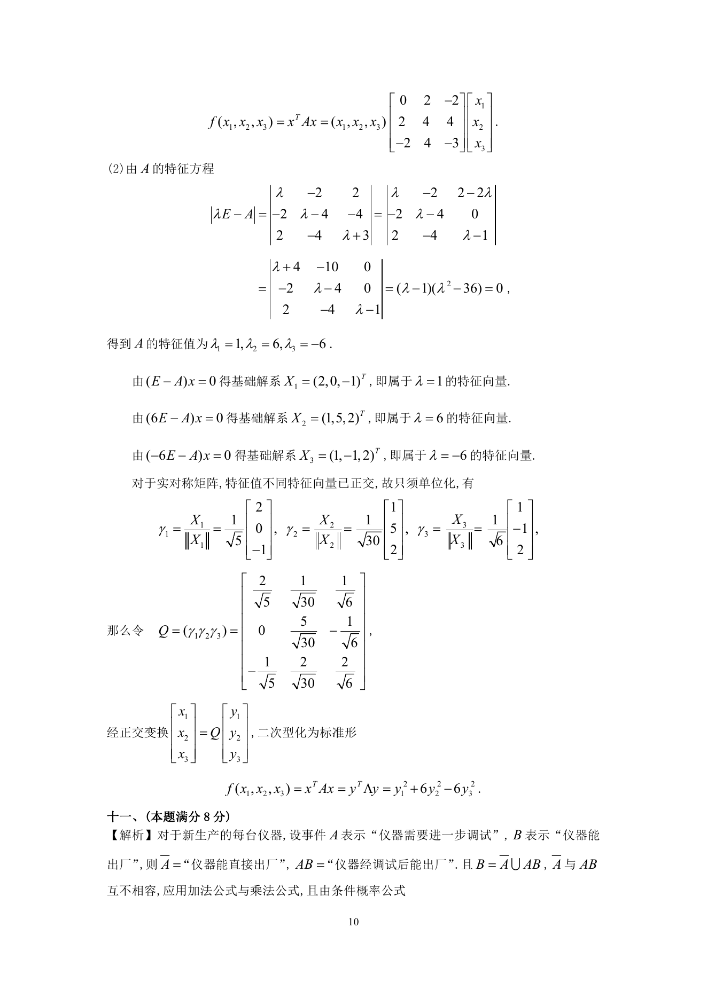
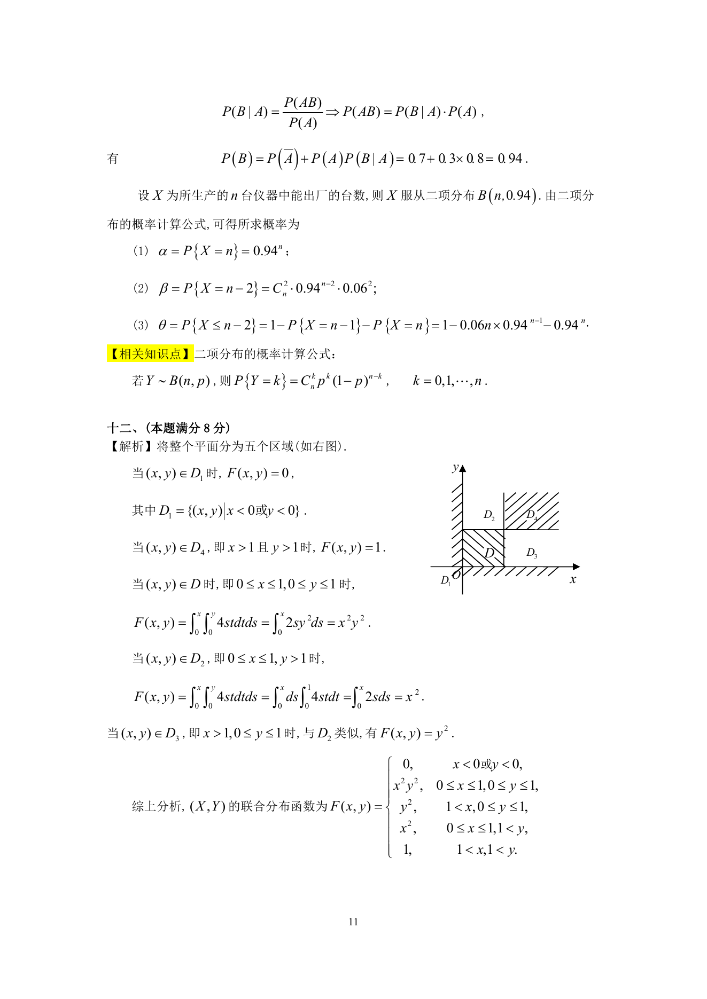

# 1995 数学三第 19 题

## 题目

假设一厂家生产的每台仪器，以概率$0.70$可以直接出厂；
以概率$0.30$需进一步调试，经调试后以概率$0.80$可以出厂；以概率$0.20$定为不合格品不能出厂．
现该厂新生产了$n$（$n \ge 2$）台仪器（假设各台仪器的生产过程相互独立）．求：

1. 全部能出厂的概率$\alpha$；
2. 其中恰好有两台不能出厂的概率$\beta$；
3. 其中至少有两台不能出厂的概率$\theta$．

## 标准答案

见答案解析页图

## 解析

解析见下方答案解析页图；PDF 文本层公式不稳定，未直接转写为 LaTeX。

## 答案解析页图

## 来源

- 题目来源：1995 年数学三 TeX 试卷源（试卷四）。
- 答案解析来源：1995年数学三真题答案解析.pdf。
- 页面图只作为原卷/解析复核依据；题干正文已按 TeX 源整理为 LaTeX。
