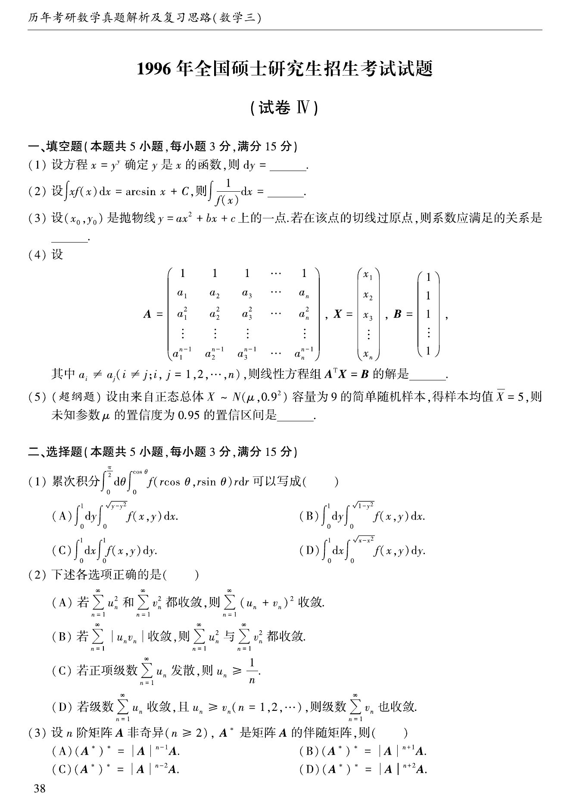
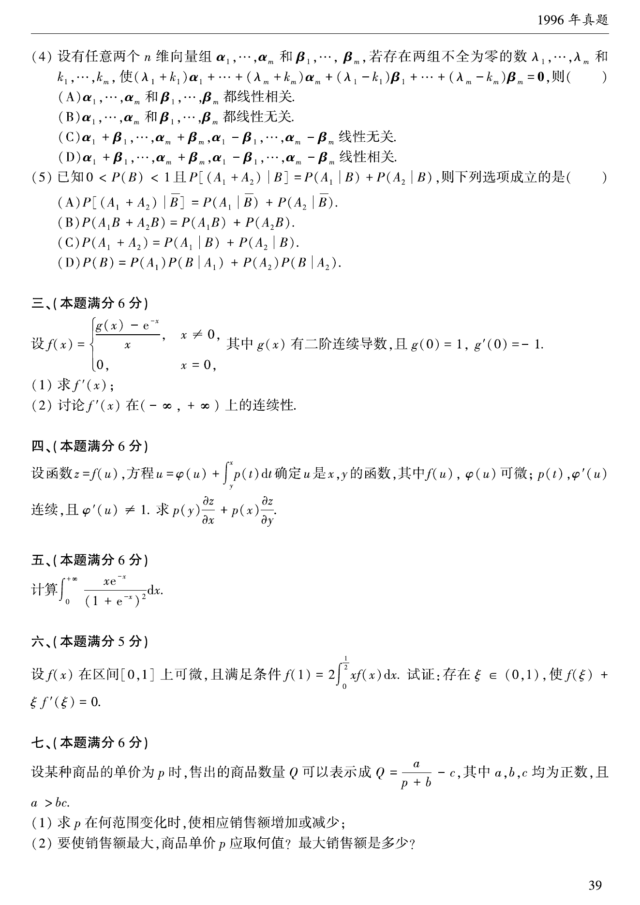
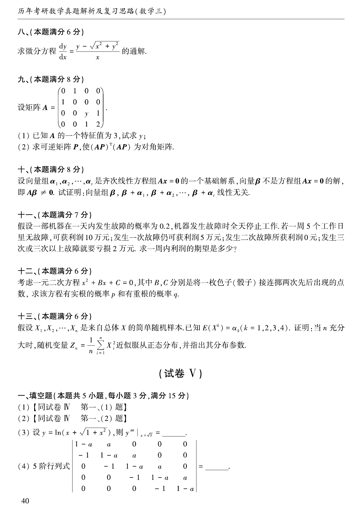

# 1996 年考研数学三真题

资料类型：考研数学三历年真题
年份：1996
科目：数学三
整理状态：TeX 题干源整理，答案解析 PDF 文本层拆分

## 原卷页图

## 填空题（本题共5小题，每小题3分，满分15分）

### 第 1 题

- 题型：填空题
- 题号：1
- 分值：3
- 模块：高等数学
- 校对状态：已按 TeX 源整理

设方程$x = y^y$确定$y$是$x$的函数，则$\,\mathrm{d}y =$ ____．

### 第 2 题

- 题型：填空题
- 题号：2
- 分值：3
- 模块：高等数学
- 校对状态：已按 TeX 源整理

设$\int x f(x)\,\mathrm{d}x = \arcsin x + C$，则$\int \frac{1}{f(x)} \,\mathrm{d}x =$ ____．

### 第 3 题

- 题型：填空题
- 题号：3
- 分值：3
- 模块：高等数学
- 校对状态：已按 TeX 源整理

设$\left(x_0,y_0 \right)$是抛物线$y = ax^2 + bx + c$上的一点，若在该点的切线过原点，则系数应满足的关系是 ____．

### 第 4 题

- 题型：填空题
- 题号：4
- 分值：3
- 模块：线性代数
- 校对状态：已按 TeX 源整理

设
$$A = \begin{pmatrix}
1 & 1 & 1 & \cdots & 1 \\
a_1 & a_2 & a_3 & \cdots & a_n \\
a_1^2 & a_2^2 & a_3^2 & \cdots & a_n^2 \\
\vdots & \vdots & \vdots & & \vdots \\
a_1^{n - 1} & a_2^{n - 1} & a_3^{n - 1} & \cdots & a_n^{n - 1}
\end{pmatrix}, X = \begin{pmatrix}
x_1 \\
x_2 \\
x_3 \\
\vdots \\
x_n
\end{pmatrix}, B = \begin{pmatrix}
1 \\
1 \\
1 \\
\vdots \\
1
\end{pmatrix},$$
其中$a_i \ne a_j$（$i \ne j;i,j = 1,2, \cdots ,n$）．则线性方程组$A^T X = B$的解是 ____．

### 第 5 题

- 题型：填空题
- 题号：5
- 分值：3
- 模块：概率统计
- 校对状态：已按 TeX 源整理

设由来自正态总体$X\sim N(\mu ,0.9^2)$容量为9的简单随机样本，得样本均值$\overline{X}= 5$，
则未知参数$\mu$的置信度为0.95的置信区间为 ____．

## 选择题（本题共5小题，每小题3分，满分15分）

### 第 6 题

- 题型：选择题
- 题号：6
- 分值：3
- 模块：高等数学
- 校对状态：已按 TeX 源整理

累次积分$\int_0^{\frac{\pi}{2}} \d\theta \int_0^{\cos \theta} f(r\cos \theta ,r\sin \theta) r\,\mathrm{d}r$
可以写成（ ）

A. $\int_0^1\,\mathrm{d}y\int_0^{\sqrt{y - y^2}} f(x,y) \,\mathrm{d}x$．

B. $\int_0^1\,\mathrm{d}y\int_0^{\sqrt{1 - y^2}} f(x,y) \,\mathrm{d}x$．

C. $\int_0^1\,\mathrm{d}x\int_0^1f(x,y) \,\mathrm{d}y$．

D. $\int_0^1\,\mathrm{d}x\int_0^{\sqrt{x - x^2}} f(x,y) \,\mathrm{d}y$．

### 第 7 题

- 题型：选择题
- 题号：7
- 分值：3
- 模块：高等数学
- 校对状态：已按 TeX 源整理

下述各选项正确的是（ ）

A. 若$\sum_{n = 1}^{\infty}u_n^2$和$\sum_{n = 1}^{\infty}v_n^2$都收敛，
则$\sum_{n = 1}^{\infty}(u_n^{} + v_n)^2$收敛．

B. $\sum_{n = 1}^{\infty}\left| u_n^{}v_n \right|$收敛，
则$\sum_{n = 1}^{\infty}u_n^2$与$\sum_{n = 1}^{\infty}v_n^2$都收敛．

C. 若正项级数$\sum_{n = 1}^{\infty}u_n^{}$发散，则$u_n^{} \ge \frac{1}{n}$．

D. 若级数$\sum_{n = 1}^{\infty}u_n^{}$收敛，且$u_n^{} \ge v_n$（$n = 1,2, \cdots$），
则级数$\sum_{n = 1}^{\infty}v_n^{}$也收敛．

### 第 8 题

- 题型：选择题
- 题号：8
- 分值：3
- 模块：线性代数
- 校对状态：已按 TeX 源整理

设$n$阶矩阵$A$非奇异（$n \ge 2$），$A^*$是矩阵$A$的伴随矩阵，则（ ）

A. $(A^*)^* = |A|^{n - 1} A$．

B. $(A^*)^* = |A|^{n + 1} A$．

C. $(A^*)^* = |A|^{n - 2} A$．

D. $(A^*)^* = |A|^{n + 2} A$．

### 第 9 题

- 题型：选择题
- 题号：9
- 分值：3
- 模块：线性代数
- 校对状态：已按 TeX 源整理

设有任意两个$n$维向量组$\alpha_1, \cdots ,\alpha_m$和$\beta_1, \cdots ,\beta_m$,
若存在两组不全为零的数$\lambda_1, \cdots ,\lambda_m$和$k_1, \cdots ,k_m$，使
$$(\lambda_1 + k_1)\alpha_1 + \cdots + (\lambda_m + k_m)\alpha_m + (\lambda_1 - k_1)\beta_1
+ \cdots + (\lambda_m - k_m)\beta_m = 0,$$
则（ ）

A. $\alpha_1, \cdots ,\alpha_m$和$\beta_1, \cdots ,\beta_m$都线性相关．

B. $\alpha_1, \cdots ,\alpha_m$和$\beta_1, \cdots ,\beta_m$都线性无关．

C. $\alpha_1+\beta_1, \cdots, \alpha_m+\beta_m, \alpha_1-\beta_1, \cdots, \alpha_m-\beta_m$线性无关．

D. $\alpha_1+\beta_1, \cdots, \alpha_m+\beta_m, \alpha_1-\beta_1, \cdots, \alpha_m-\beta_m$线性相关．

### 第 10 题

- 题型：选择题
- 题号：10
- 分值：3
- 模块：高等数学
- 校对状态：已按 TeX 源整理

已知$0 < P(B) < 1$且$P[(A_1 + A_2)|B] = P(A_1|B) + P(A_2|B)$，则下列选项成立的是（ ）

A. $P[(A_1 + A_2)|\overline{B}] = P(A_1|\overline{B}) + P(A_2|\overline{B})$．

B. $P(A_1 B + A_2 B) = P(A_1 B) + P(A_2 B)$．

C. $P(A_1 + A_2) = P(A_1|B) + P(A_2|B)$．

D. $P(B) = P(A_1)P(B|A_1) + P(A_2)P(B|A_2)$．

## 第 3 部分（本题满分6分）

### 第 11 题

- 题型：解答题
- 题号：11
- 分值：6
- 模块：高等数学
- 校对状态：已按 TeX 源整理

设$f(x) = \begin{cases}
\frac{g(x) - \mathrm{e}^{- x}}{x}, & x \ne 0, \\
0, & x = 0,
\end{cases}$其中$g(x)$有二阶连续导数，且$g(0) = 1,g'(0) = - 1$．

1. 求$f'(x)$；
2. 讨论$f'(x)$在$(-\infty , +\infty)$上的连续性．

## 第 4 部分（本题满分6分）

### 第 12 题

- 题型：解答题
- 题号：12
- 分值：6
- 模块：高等数学
- 校对状态：已按 TeX 源整理

设函数$z = f(u)$，方程$u = \varphi(u) + \int_y^x p(t)\,\mathrm{d}t$确定$u$是$x,y$的函数，
其中$f(u),\varphi(u)$可微；$p(t)$,$\varphi'(u)$连续，且$\varphi'(u) \ne 1$．
求$p(y)\frac{

tialz}{

tialx} + p(x)\frac{

tialz}{

tialy}$．

## 第 5 部分（本题满分6分）

### 第 13 题

- 题型：解答题
- 题号：13
- 分值：6
- 模块：高等数学
- 校对状态：已按 TeX 源整理

计算$\int_0^{+\infty} \frac{x\mathrm{e}^{- x}}{(1 + \mathrm{e}^{- x})^2} \,\mathrm{d}x$．

## 第 6 部分（本题满分5分）

### 第 14 题

- 题型：解答题
- 题号：14
- 分值：5
- 模块：高等数学
- 校对状态：已按 TeX 源整理

设$f(x)$在区间$[0,1]$上可微，且满足条件$f(1) = 2\int_0^{\frac{1}{2}} xf(x)\,\mathrm{d}x$．
试证：存在$\xi \in(0,1)$使$f(\xi) + \xi f'(\xi) = 0$．

## 第 7 部分（本题满分6分）

### 第 15 题

- 题型：解答题
- 题号：15
- 分值：6
- 模块：高等数学
- 校对状态：已按 TeX 源整理

设某种商品的单价为$p$时，售出的商品数量$Q$可以表示成$Q = \frac{a}{p + b} - c$,
其中$a$, $b$, $c$均为正数，且$a > bc$．

1. 求$p$在何范围变化时，使相应销售额增加或减少．
2. 要使销售额最大，商品单价$p$应取何值？最大销售额是多少？

## 第 8 部分（本题满分6分）

### 第 16 题

- 题型：解答题
- 题号：16
- 分值：6
- 模块：高等数学
- 校对状态：已按 TeX 源整理

求微分方程$\frac{\,\mathrm{d}y}{\,\mathrm{d}x} = \frac{y - \sqrt{x^2 + y^2}}{x}$的通解．

## 第 9 部分（本题满分8分）

### 第 17 题

- 题型：解答题
- 题号：17
- 分值：8
- 模块：线性代数
- 校对状态：已按 TeX 源整理

设矩阵$A = \begin{pmatrix}
0 & 1 & 0 & 0 \\
1 & 0 & 0 & 0 \\
0 & 0 & y & 1 \\
0 & 0 & 1 & 2
\end{pmatrix}$．

1. 已知$A$的一个特征值为$3$，试求$y$；
2. 求矩阵$P$，使$(AP)^T(AP)$为对角矩阵．

## 第 10 部分（本题满分8分）

### 第 18 题

- 题型：解答题
- 题号：18
- 分值：8
- 模块：线性代数
- 校对状态：已按 TeX 源整理

设向量$\alpha_1,\alpha_2, \cdots ,\alpha_t$是齐次线性方程组$AX = 0$的一个基础解系，
向量$\beta$不是方程组$AX = 0$的解，即$A\beta \ne 0$．
试证明：向量组$\beta ,\beta + \alpha_1,\beta + \alpha_2, \cdots ,\beta + \alpha_t$线性无关．

## 第 11 部分（本题满分7分）

### 第 19 题

- 题型：解答题
- 题号：19
- 分值：7
- 模块：概率统计
- 校对状态：已按 TeX 源整理

假设一部机器在一天内发生故障的概率为$0.2$，机器发生故障时全天停止工作，
若一周$5$个工作日里无故障，可获利润$10$万元；
发生一次故障仍可获得利润$5$万元；发生两次故障所获利润$0$元；发生三次或三次以上故障就要亏损$2$万元．
求一周内期望利润是多少?

## 第 12 部分（本题满分6分）

### 第 20 题

- 题型：解答题
- 题号：20
- 分值：6
- 模块：概率统计
- 校对状态：已按 TeX 源整理

考虑一元二次方程$x^2 + Bx + C = 0$，其中$B,C$分别是将一枚色子(骰子)接连掷两次先后出现的点数．
求该方程有实根的概率$p$和有重根的概率$q$．

## 第 13 部分（本题满分6分）

### 第 21 题

- 题型：解答题
- 题号：21
- 分值：6
- 模块：概率统计
- 校对状态：已按 TeX 源整理

假设$X_1,X_2, \cdots ,X_n$是来自总体X的简单随机样本；已知$EX^k = a_k(k = 1,2,3,4)$．
证明：当$n$充分大时，随机变量$Z_n = \frac{1}{n}\sum_{i = 1}^n X_i^2$近似服从正态分布，并指出其分布参数．
