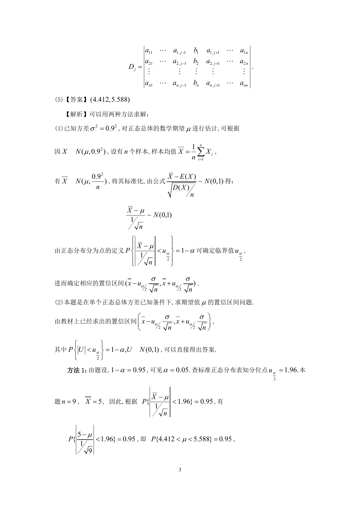

# 1996 数学三第 4 题

## 题目

设
$$A = \begin{pmatrix}
1 & 1 & 1 & \cdots & 1 \\
a_1 & a_2 & a_3 & \cdots & a_n \\
a_1^2 & a_2^2 & a_3^2 & \cdots & a_n^2 \\
\vdots & \vdots & \vdots & & \vdots \\
a_1^{n - 1} & a_2^{n - 1} & a_3^{n - 1} & \cdots & a_n^{n - 1}
\end{pmatrix}, X = \begin{pmatrix}
x_1 \\
x_2 \\
x_3 \\
\vdots \\
x_n
\end{pmatrix}, B = \begin{pmatrix}
1 \\
1 \\
1 \\
\vdots \\
1
\end{pmatrix},$$
其中$a_i \ne a_j$（$i \ne j;i,j = 1,2, \cdots ,n$）．则线性方程组$A^T X = B$的解是 \underline{\qquad}．

## 标准答案

见答案解析页图

## 解析

该题答案见下方答案解析页图；PDF 文本层顺序和公式不稳定，未直接转写为标准 LaTeX 文本。

## 答案解析页图

## 来源

- 题目来源：1996 年数学三 TeX 试卷源（试卷四）。
- 答案解析来源：1996年数学三真题答案解析.pdf。
- 页面图只作为原卷/解析复核依据；题干正文已按 TeX 源整理为 LaTeX。
