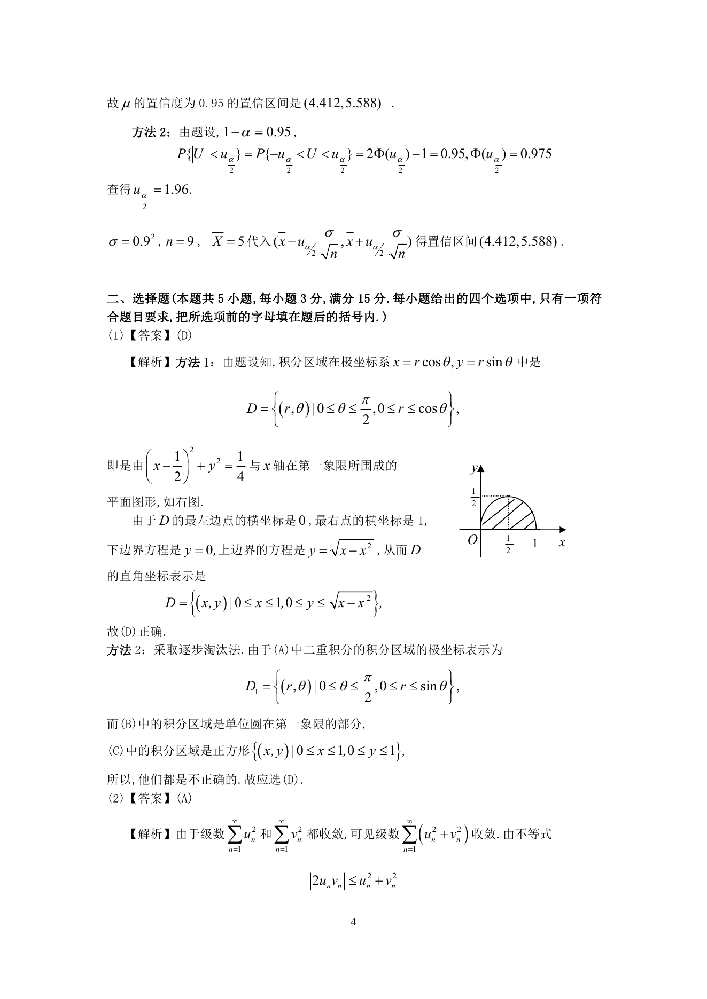

# 1996 数学三第 6 题

## 题目

累次积分$\int_0^{\frac{\pi}{2}} \d\theta \int_0^{\cos \theta} f(r\cos \theta ,r\sin \theta) r\,\mathrm{d}r$
可以写成（ ）

A. $\int_0^1\,\mathrm{d}y\int_0^{\sqrt{y - y^2}} f(x,y) \,\mathrm{d}x$．

B. $\int_0^1\,\mathrm{d}y\int_0^{\sqrt{1 - y^2}} f(x,y) \,\mathrm{d}x$．

C. $\int_0^1\,\mathrm{d}x\int_0^1f(x,y) \,\mathrm{d}y$．

D. $\int_0^1\,\mathrm{d}x\int_0^{\sqrt{x - x^2}} f(x,y) \,\mathrm{d}y$．

## 标准答案

D

## 解析

答案为 D。解析见下方答案解析页图；PDF 文本层公式不稳定，未直接转写为 LaTeX。

## 答案解析页图

## 来源

- 题目来源：1996 年数学三 TeX 试卷源（试卷四）。
- 答案解析来源：1996年数学三真题答案解析.pdf。
- 页面图只作为原卷/解析复核依据；题干正文已按 TeX 源整理为 LaTeX。
