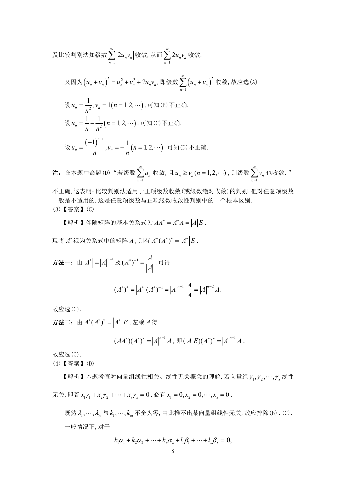

# 1996 数学三第 8 题

## 题目

设$n$阶矩阵$A$非奇异（$n \ge 2$），$A^*$是矩阵$A$的伴随矩阵，则（ ）

A. $(A^*)^* = |A|^{n - 1} A$．

B. $(A^*)^* = |A|^{n + 1} A$．

C. $(A^*)^* = |A|^{n - 2} A$．

D. $(A^*)^* = |A|^{n + 2} A$．

## 标准答案

C

## 解析

答案为 C。解析见下方答案解析页图；PDF 文本层公式不稳定，未直接转写为 LaTeX。

## 答案解析页图

## 来源

- 题目来源：1996 年数学三 TeX 试卷源（试卷四）。
- 答案解析来源：1996年数学三真题答案解析.pdf。
- 页面图只作为原卷/解析复核依据；题干正文已按 TeX 源整理为 LaTeX。
