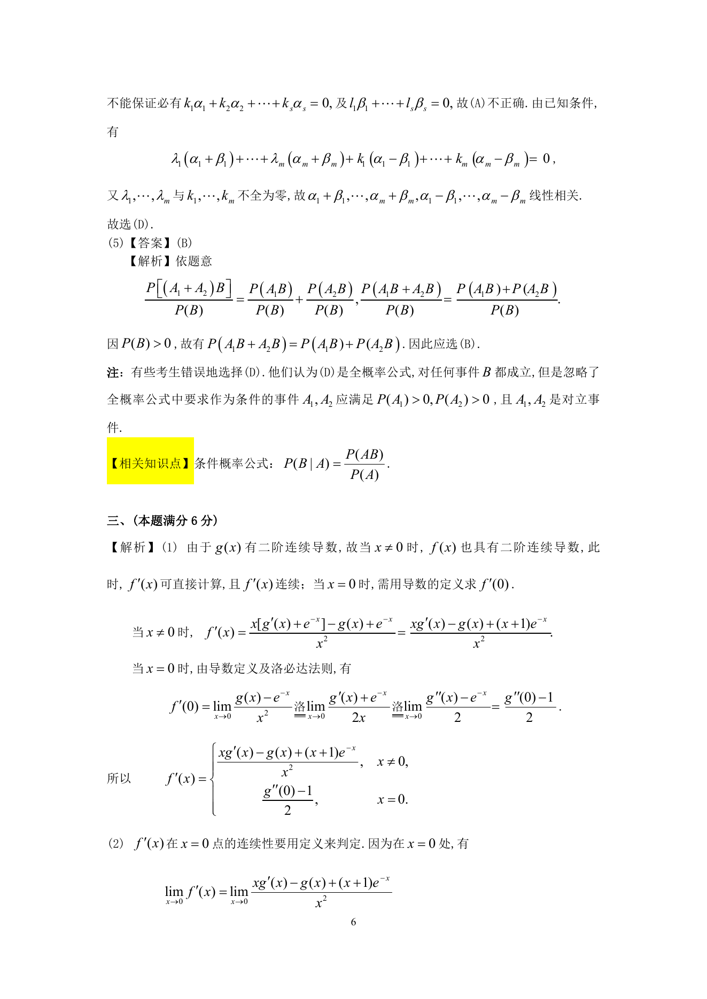

# 1996 数学三第 9 题

## 题目

设有任意两个$n$维向量组$\alpha_1, \cdots ,\alpha_m$和$\beta_1, \cdots ,\beta_m$,
若存在两组不全为零的数$\lambda_1, \cdots ,\lambda_m$和$k_1, \cdots ,k_m$，使
$$(\lambda_1 + k_1)\alpha_1 + \cdots + (\lambda_m + k_m)\alpha_m + (\lambda_1 - k_1)\beta_1
+ \cdots + (\lambda_m - k_m)\beta_m = 0,$$
则（ ）

A. $\alpha_1, \cdots ,\alpha_m$和$\beta_1, \cdots ,\beta_m$都线性相关．

B. $\alpha_1, \cdots ,\alpha_m$和$\beta_1, \cdots ,\beta_m$都线性无关．

C. $\alpha_1+\beta_1, \cdots, \alpha_m+\beta_m, \alpha_1-\beta_1, \cdots, \alpha_m-\beta_m$线性无关．

D. $\alpha_1+\beta_1, \cdots, \alpha_m+\beta_m, \alpha_1-\beta_1, \cdots, \alpha_m-\beta_m$线性相关．

## 标准答案

D

## 解析

答案为 D。解析见下方答案解析页图；PDF 文本层公式不稳定，未直接转写为 LaTeX。

## 答案解析页图

## 来源

- 题目来源：1996 年数学三 TeX 试卷源（试卷四）。
- 答案解析来源：1996年数学三真题答案解析.pdf。
- 页面图只作为原卷/解析复核依据；题干正文已按 TeX 源整理为 LaTeX。
