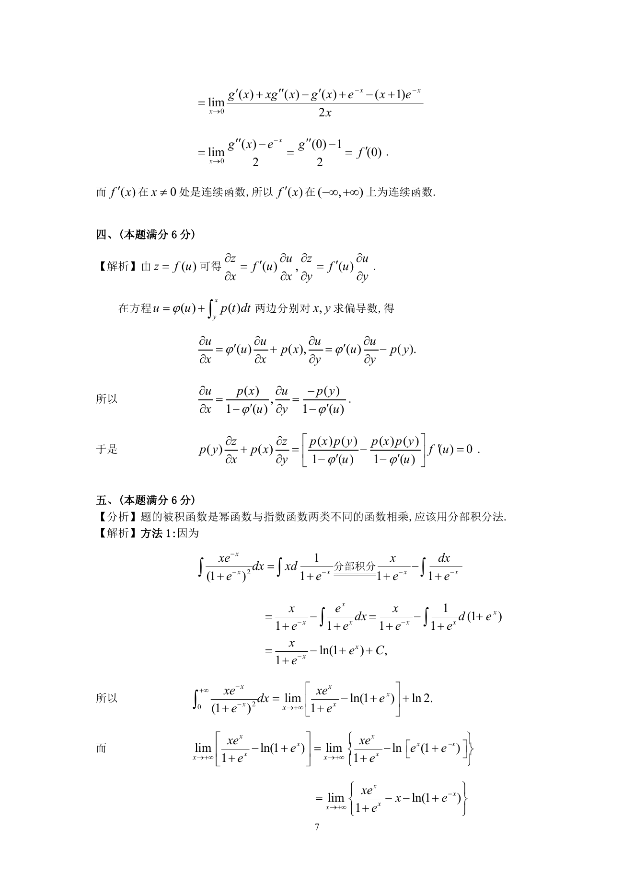

# 1996 数学三第 12 题

## 题目

设函数$z = f(u)$，方程$u = \varphi(u) + \int_y^x p(t)\,\mathrm{d}t$确定$u$是$x,y$的函数，
其中$f(u),\varphi(u)$可微；$p(t)$,$\varphi'(u)$连续，且$\varphi'(u) \ne 1$．
求$p(y)\frac{

tialz}{

tialx} + p(x)\frac{

tialz}{

tialy}$．

## 标准答案

见答案解析页图

## 解析

解析见下方答案解析页图；PDF 文本层公式不稳定，未直接转写为 LaTeX。

## 答案解析页图

## 来源

- 题目来源：1996 年数学三 TeX 试卷源（试卷四）。
- 答案解析来源：1996年数学三真题答案解析.pdf。
- 页面图只作为原卷/解析复核依据；题干正文已按 TeX 源整理为 LaTeX。
