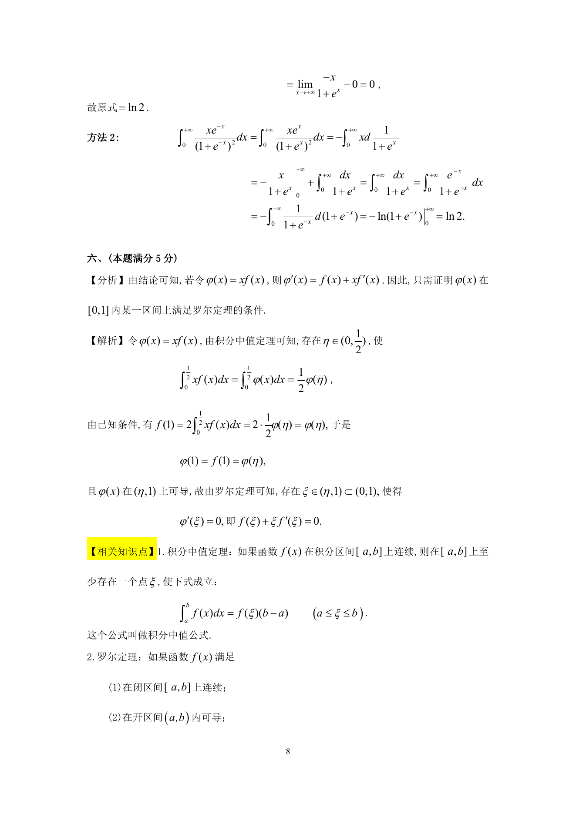
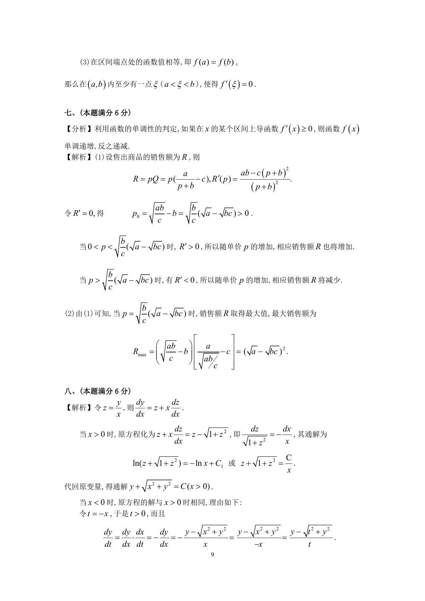

# 1996 数学三第 14 题

## 题目

设$f(x)$在区间$[0,1]$上可微，且满足条件$f(1) = 2\int_0^{\frac{1}{2}} xf(x)\,\mathrm{d}x$．
试证：存在$\xi \in(0,1)$使$f(\xi) + \xi f'(\xi) = 0$．

## 标准答案

见答案解析页图

## 解析

解析见下方答案解析页图；PDF 文本层公式不稳定，未直接转写为 LaTeX。

## 答案解析页图

## 来源

- 题目来源：1996 年数学三 TeX 试卷源（试卷四）。
- 答案解析来源：1996年数学三真题答案解析.pdf。
- 页面图只作为原卷/解析复核依据；题干正文已按 TeX 源整理为 LaTeX。
