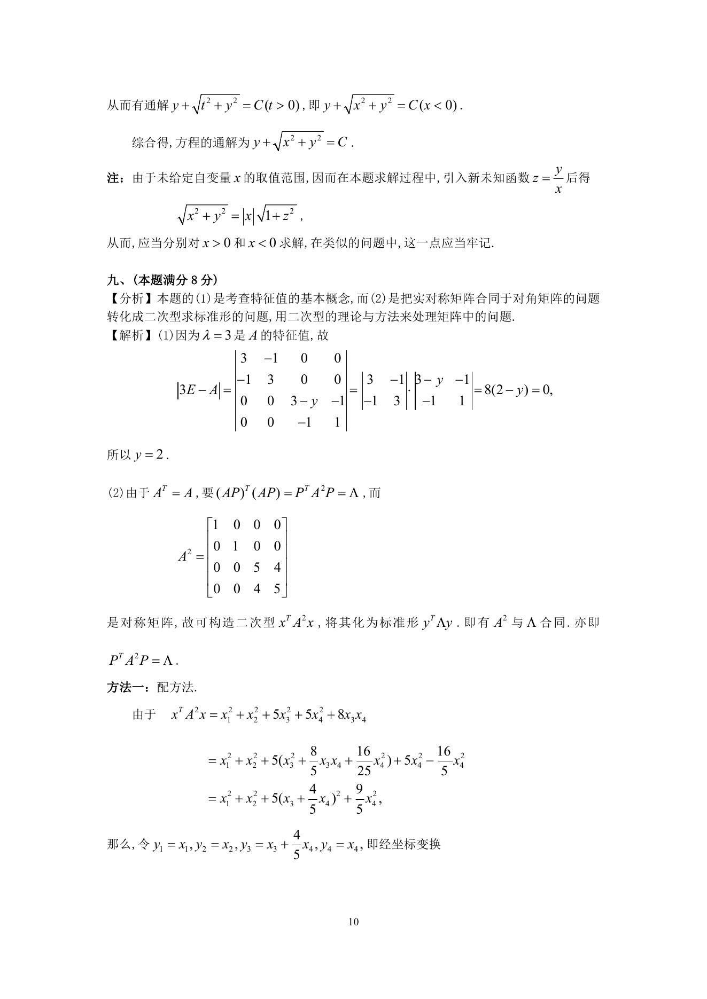
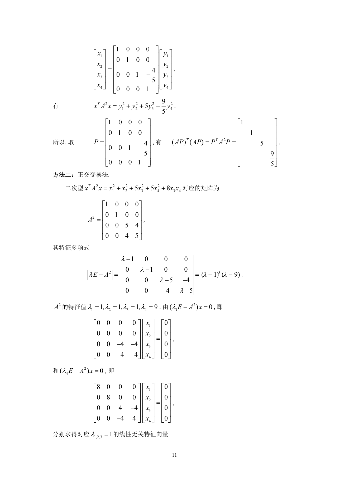
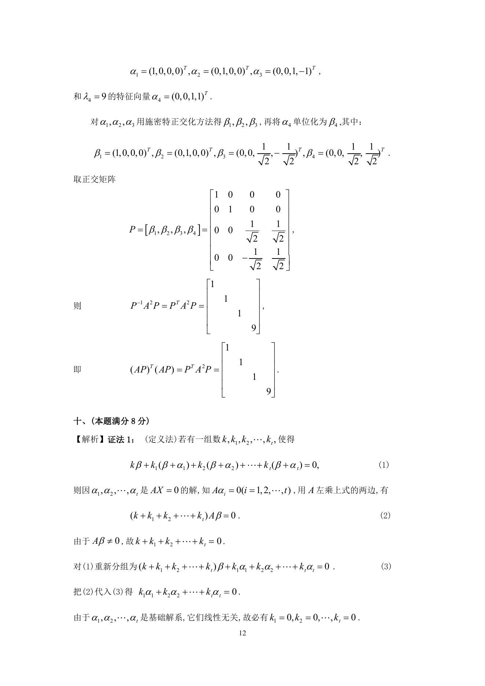

# 1996 数学三第 17 题

## 题目

设矩阵$A = \begin{pmatrix}
0 & 1 & 0 & 0 \\
1 & 0 & 0 & 0 \\
0 & 0 & y & 1 \\
0 & 0 & 1 & 2
\end{pmatrix}$．

1. 已知$A$的一个特征值为$3$，试求$y$；
2. 求矩阵$P$，使$(AP)^T(AP)$为对角矩阵．

## 标准答案

见答案解析页图

## 解析

解析见下方答案解析页图；PDF 文本层公式不稳定，未直接转写为 LaTeX。

## 答案解析页图

## 来源

- 题目来源：1996 年数学三 TeX 试卷源（试卷四）。
- 答案解析来源：1996年数学三真题答案解析.pdf。
- 页面图只作为原卷/解析复核依据；题干正文已按 TeX 源整理为 LaTeX。
