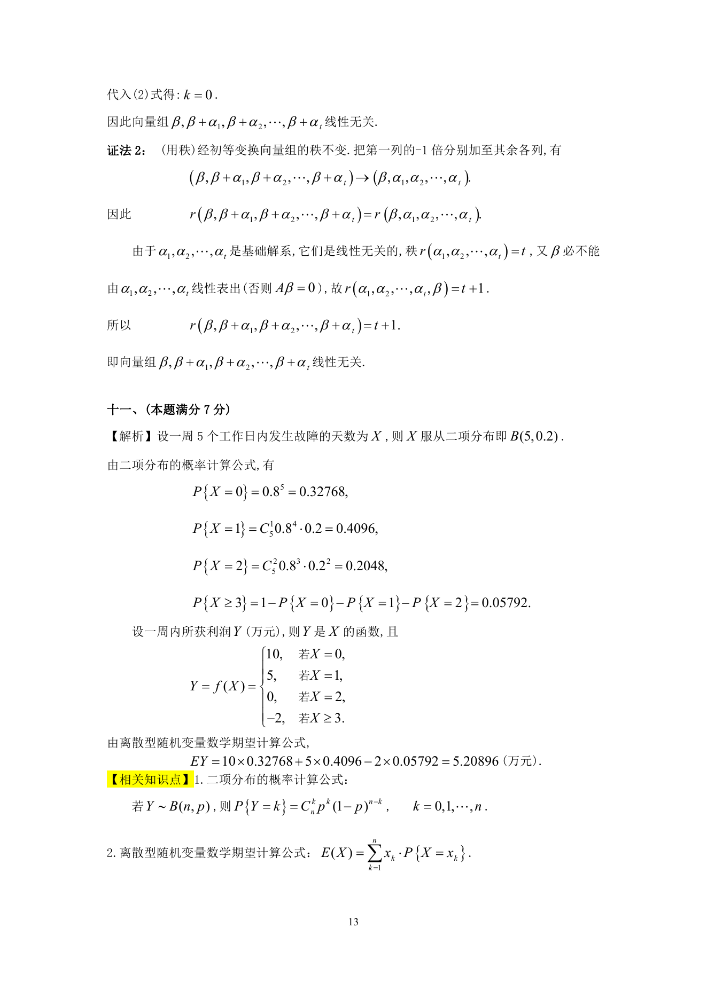
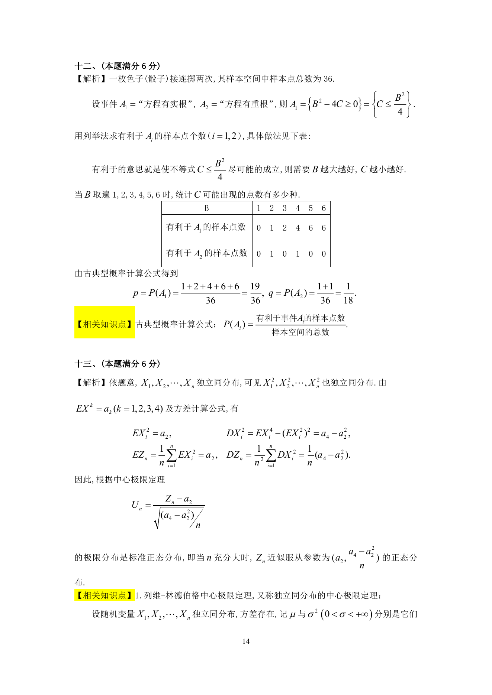

# 1996 数学三第 19 题

## 题目

假设一部机器在一天内发生故障的概率为$0.2$，机器发生故障时全天停止工作，
若一周$5$个工作日里无故障，可获利润$10$万元；
发生一次故障仍可获得利润$5$万元；发生两次故障所获利润$0$元；发生三次或三次以上故障就要亏损$2$万元．
求一周内期望利润是多少?

## 标准答案

见答案解析页图

## 解析

解析见下方答案解析页图；PDF 文本层公式不稳定，未直接转写为 LaTeX。

## 答案解析页图

## 来源

- 题目来源：1996 年数学三 TeX 试卷源（试卷四）。
- 答案解析来源：1996年数学三真题答案解析.pdf。
- 页面图只作为原卷/解析复核依据；题干正文已按 TeX 源整理为 LaTeX。
