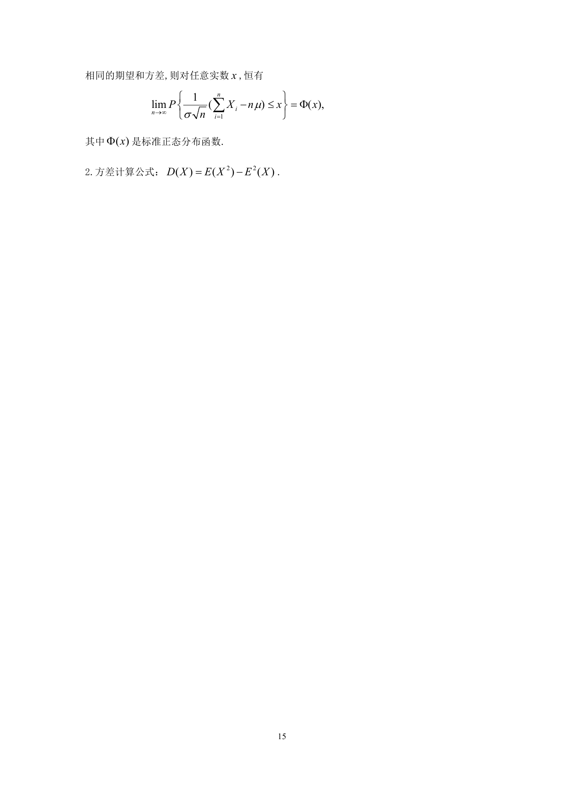

# 1996 数学三第 21 题

## 题目

假设$X_1,X_2, \cdots ,X_n$是来自总体X的简单随机样本；已知$EX^k = a_k(k = 1,2,3,4)$．
证明：当$n$充分大时，随机变量$Z_n = \frac{1}{n}\sum_{i = 1}^n X_i^2$近似服从正态分布，并指出其分布参数．

## 标准答案

见答案解析页图

## 解析

解析见下方答案解析页图；PDF 文本层公式不稳定，未直接转写为 LaTeX。

## 答案解析页图

## 来源

- 题目来源：1996 年数学三 TeX 试卷源（试卷四）。
- 答案解析来源：1996年数学三真题答案解析.pdf。
- 页面图只作为原卷/解析复核依据；题干正文已按 TeX 源整理为 LaTeX。
