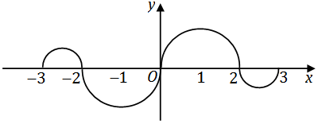

# 2007 年考研数学三真题

## 第 1 题

当 $x\to0^+$ 时，与 $\sqrt{x}$ 等价的无穷小量是

A. $1-e^{\sqrt{x}}$

B. $\ln(1+\sqrt{x})$

C. $\sqrt{1+\sqrt{x}}-1$

D. $1-\cos\sqrt{x}$

## 第 2 题

设函数 $f(x)$ 在 $x=0$ 处连续，下列命题错误的是（ ）。

A. 若 $\displaystyle\lim_{x\to0}\frac{f(x)}{x}$ 存在，则 $f(0)=0$
B. 若 $\displaystyle\lim_{x\to0}\frac{f(x)+f(-x)}{x}$ 存在，则 $f(0)=0$
C. 若 $\displaystyle\lim_{x\to0}\frac{f(x)}{x}$ 存在，则 $f'(0)$ 存在
D. 若 $\displaystyle\lim_{x\to0}\frac{f(x)-f(-x)}{x}$ 存在，则 $f'(0)$ 存在

## 第 3 题

函数图像：

图形说明：$y=f(x)$ 在 $[-3,-2]$ 上为直径 $1$ 的上半圆周，在 $[2,3]$ 上为直径 $1$ 的下半圆周；在 $[-2,0]$ 上为直径 $2$ 的下半圆周，在 $[0,2]$ 上为直径 $2$ 的上半圆周。

题干：

如图，连续函数 $y=f(x)$ 在区间 $[-3,-2]$、$[2,3]$ 上的图形分别是直径为 $1$ 的上、下半圆周，在区间 $[-2,0]$、$[0,2]$ 上的图形分别是直径为 $2$ 的下、上半圆周。设

$$
F(x)=\int_0^x f(t)\,dt,
$$

则下列结论正确的是（ ）。

A. $F(3)=-\frac{3}{4}F(-2)$
B. $F(3)=\frac{5}{4}F(2)$
C. $F(-3)=\frac{3}{4}F(2)$
D. $F(-3)=-\frac{5}{4}F(-2)$

## 第 4 题

设函数 $f(x,y)$ 连续，则二次积分
$$
\int_{\pi/2}^{\pi}dx\int_{\sin x}^{1}f(x,y)\,dy
$$
等于（  ）  
(A) $\displaystyle\int_0^1dy\int_{\pi+\arcsin y}^{\pi}f(x,y)\,dx$  
(B) $\displaystyle\int_0^1dy\int_{\pi-\arcsin y}^{\pi}f(x,y)\,dx$  
(C) $\displaystyle\int_0^1dy\int_{\pi/2}^{\pi+\arcsin y}f(x,y)\,dx$  
(D) $\displaystyle\int_0^1dy\int_{\pi/2}^{\pi-\arcsin y}f(x,y)\,dx$

## 第 5 题

设某商品的需求函数为 $Q=160-2p$，其中 $Q,p$ 分别表示需求量和价格。若该商品需求弹性的绝对值等于 $1$，则商品的价格是

A. $10$

B. $20$

C. $30$

D. $40$

## 第 6 题

曲线

$$
y=\frac{1}{x}+\ln(1+e^x)
$$

渐近线的条数为（ ）。

A. $0$
B. $1$
C. $2$
D. $3$

## 第 7 题

设向量组 $\boldsymbol{\alpha}_1,\boldsymbol{\alpha}_2,\boldsymbol{\alpha}_3$ 线性无关，则下列向量组线性相关的是（ ）。

A. $\boldsymbol{\alpha}_1-\boldsymbol{\alpha}_2,\ \boldsymbol{\alpha}_2-\boldsymbol{\alpha}_3,\ \boldsymbol{\alpha}_3-\boldsymbol{\alpha}_1$
B. $\boldsymbol{\alpha}_1+\boldsymbol{\alpha}_2,\ \boldsymbol{\alpha}_2+\boldsymbol{\alpha}_3,\ \boldsymbol{\alpha}_3+\boldsymbol{\alpha}_1$
C. $\boldsymbol{\alpha}_1-2\boldsymbol{\alpha}_2,\ \boldsymbol{\alpha}_2-2\boldsymbol{\alpha}_3,\ \boldsymbol{\alpha}_3-2\boldsymbol{\alpha}_1$
D. $\boldsymbol{\alpha}_1+2\boldsymbol{\alpha}_2,\ \boldsymbol{\alpha}_2+2\boldsymbol{\alpha}_3,\ \boldsymbol{\alpha}_3+2\boldsymbol{\alpha}_1$

## 第 8 题

设矩阵

$$
A=
\begin{pmatrix}
2&-1&-1\\
-1&2&-1\\
-1&-1&2
\end{pmatrix},
\qquad
B=
\begin{pmatrix}
1&0&0\\
0&1&0\\
0&0&0
\end{pmatrix},
$$

则 $A$ 与 $B$（ ）。

A. 合同，且相似
B. 合同，但不相似
C. 不合同，但相似
D. 既不合同，也不相似

## 第 9 题

某人向同一目标独立、重复射击，每次射击命中目标的概率为 $p\ (0<p<1)$，则此人第 $4$ 次射击恰好第 $2$ 次命中目标的概率为（ ）。

A. $3p(1-p)^2$
B. $6p(1-p)^2$
C. $3p^2(1-p)^2$
D. $6p^2(1-p)^2$

## 第 10 题

设随机变量 $(X,Y)$ 服从二维正态分布，且 $X$ 与 $Y$ 不相关，$f_X(x),f_Y(y)$ 分别表示 $X,Y$ 的概率密度，则在 $Y=y$ 的条件下，$X$ 的条件概率密度 $f_{X\mid Y}(x\mid y)$ 为（ ）。

A. $f_X(x)$
B. $f_Y(y)$
C. $f_X(x)f_Y(y)$
D. $\dfrac{f_X(x)}{f_Y(y)}$

## 第 11 题

$$
\lim_{x\to+\infty}\frac{x^3+x^2+1}{2^x+x^3}(\sin x+\cos x)=\underline{\qquad}.
$$

## 第 12 题

设函数
$$
y=\frac{1}{2x+3},
$$
则 $y^{(n)}(0)=\underline{\qquad}$。

## 第 13 题

设 $f(u,v)$ 是二元可微函数，$z=f\!\left(\dfrac{y}{x},\dfrac{x}{y}\right)$，则
$$
x\frac{\partial z}{\partial x}-y\frac{\partial z}{\partial y}=\underline{\qquad}.
$$

## 第 14 题

微分方程

$$
\frac{dy}{dx}=\frac{y}{x}-\frac12\left(\frac{y}{x}\right)^3
$$

满足 $y\big|_{x=1}=1$ 的特解为 $y=\underline{\qquad}$。

## 第 15 题

设矩阵

$$
A=
\begin{pmatrix}
0&1&0&0\\
0&0&1&0\\
0&0&0&1\\
0&0&0&0
\end{pmatrix},
$$

则 $A^3$ 的秩为______。

## 第 16 题

在区间 $(0,1)$ 中随机地取两个数，则这两个数之差的绝对值小于 $\frac{1}{2}$ 的概率为______。

## 第 17 题

设函数$y = y(x)$由方程$y\ln y - x + y = 0$确定，试判断曲线$y = y(x)$在点$(1,1)$附近的凹凸性．

## 第 18 题

设二元函数
$$
f(x,y)=
\begin{cases}
x^2, & |x|+|y|\le1,\\[2mm]
\dfrac{1}{\sqrt{x^2+y^2}}, & 1<|x|+|y|\le2,
\end{cases}
$$
计算二重积分
$$
\iint_D f(x,y)\,d\sigma,
$$
其中
$$
D=\{(x,y)\mid |x|+|y|\le2\}.
$$

## 第 19 题

设函数$f(x)$，$g(x)$在$\;\left[a,b \right]$上连续，在$(a,b)$内二阶可导且存在相等的最大值，又$f(a)$=$g(a)$，$f(b)$=$g(b)$，证明：

 
（A）存在$\eta \in(a,b)$，使得$f(\eta) = g(\eta)$；
 
（B）存在$\xi \in(a,b)$，使得$f''(\xi) = g''(\xi)$．

## 第 20 题

将函数$f(x) = \frac{1}{x^2 - 3x - 4}$展开成$x - 1$的幂级数，并指出其收敛区间．

## 第 21 题

设线性方程组

$$
\begin{cases}
x_1+x_2+x_3=0,\\
x_1+2x_2+ax_3=0,\\
x_1+4x_2+a^2x_3=0
\end{cases}
\tag{1}
$$

与方程

$$
x_1+2x_2+x_3=a-1
\tag{2}
$$

有公共解，求 $a$ 的值及所有公共解。

## 第 22 题

设 $3$ 阶实对称矩阵 $A$ 的特征值 $\lambda_1=1,\lambda_2=2,\lambda_3=-2$，且

$$
\boldsymbol{\alpha}_1=(1,-1,1)^T
$$

是 $A$ 的属于 $\lambda_1$ 的一个特征向量。记

$$
B=A^5-4A^3+E,
$$

其中 $E$ 为 $3$ 阶单位矩阵。

(I) 验证 $\boldsymbol{\alpha}_1$ 是矩阵 $B$ 的特征向量，并求 $B$ 的全部特征值与特征向量；

(II) 求矩阵 $B$。

## 第 23 题

设二维随机变量 $(X,Y)$ 的概率密度为

$$
f(x,y)=
\begin{cases}
2-x-y,&0<x<1,\ 0<y<1,\\
0,&\text{其他}.
\end{cases}
$$

(I) 求 $P\{X>2Y\}$；

(II) 求 $Z=X+Y$ 的概率密度 $f_Z(z)$。

## 第 24 题

设总体 $X$ 的概率密度为

$$
f(x;\theta)=
\begin{cases}
\dfrac{1}{2\theta},&0<x<\theta,\\
\dfrac{1}{2(1-\theta)},&\theta\le x<1,\\
0,&\text{其他},
\end{cases}
$$

其中参数 $\theta\ (0<\theta<1)$ 未知，$X_1,X_2,\cdots,X_n$ 是来自总体 $X$ 的简单随机样本，$\overline{X}$ 是样本均值。

(I) 求参数 $\theta$ 的矩估计量 $\hat{\theta}$；

(II) 判断 $4\overline{X}^2$ 是否为 $\theta^2$ 的无偏估计量，并说明理由。
