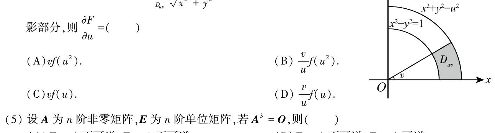

# 2008 年考研数学三真题

## 第 1 题

设函数$f(x)$在区间$[-1,1]$上连续，则
$x=0$是函数
$$
g(x)=\frac{\int_0^x f(t)\,dt}{x}
$$
的

（A）跳跃间断点。

（B）可去间断点。

（C）无穷间断点。

（D）振荡间断点。

## 第 2 题

如图，曲线段的方程为 $y=f(x)$，函数 $f(x)$ 在区间 $[0,a]$ 上有连续的导数，
则定积分
$$
\int_0^a x f'(x)\,dx
$$
等于（ ）。

（A）曲边梯形 $ABOD$ 的面积。

（B）梯形 $ABOD$ 的面积。

（C）曲边三角形 $ACD$ 的面积。

（D）三角形 $ACD$ 的面积。

## 第 3 题

设
$$
f(x,y)=e^{\sqrt{x^2+y^4}},
$$
则

（A）$f'_x(0,0)$ 和 $f'_y(0,0)$ 都存在。

（B）$f'_x(0,0)$ 存在，$f'_y(0,0)$ 不存在。

（C）$f'_x(0,0)$ 不存在，$f'_y(0,0)$ 存在。

（D）$f'_x(0,0)$ 和 $f'_y(0,0)$ 都不存在。

## 第 4 题

设函数 $f$ 连续。若
$$
F(u,v)=\iint_{D_{uv}}\frac{f(x^2+y^2)}{\sqrt{x^2+y^2}}\,dx\,dy,
$$
其中区域 $D_{uv}$ 为图中阴影部分，则
$$
\frac{\partial F}{\partial u}=（ ）
$$

（A）$vf(u^2)$。

（B）$\dfrac{v}{u}f(u^2)$。

（C）$vf(u)$。

（D）$\dfrac{v}{u}f(u)$。

## 第 5 题

设 $A$ 为 $n$ 阶非零矩阵，$E$ 为 $n$ 阶单位矩阵，满足 $A^3=O$，则

（A）$E-A$ 不可逆，$E+A$ 不可逆。

（B）$E-A$ 不可逆，$E+A$ 可逆。

（C）$E-A$ 可逆，$E+A$ 可逆。

（D）$E-A$ 可逆，$E+A$ 不可逆。

## 第 6 题

设
$$
A=\begin{pmatrix}
1 & 2 \\
2 & 1
\end{pmatrix},
$$
则在实数域上与 $A$ 合同的矩阵为

（A）
$$
\begin{pmatrix}
-2 & 1 \\
1 & -2
\end{pmatrix}.
$$

（B）
$$
\begin{pmatrix}
2 & -1 \\
-1 & 2
\end{pmatrix}.
$$

（C）
$$
\begin{pmatrix}
2 & 1 \\
1 & 2
\end{pmatrix}.
$$

（D）
$$
\begin{pmatrix}
1 & -2 \\
-2 & 1
\end{pmatrix}.
$$

## 第 7 题

设随机变量 $X,Y$ 独立同分布，且 $X$ 的分布函数为 $F(x)$，
则
$$
Z=max\left{X,Y\right}
$$
的分布函数为

（A）$F^2(x)$。

（B）$F(x)F(y)$。

（C）$1-[1-F(x)]^2$。

（D）$[1-F(x)][1-F(y)]$。

## 第 8 题

设随机变量 $X\sim N(0,1)$，$Y\sim N(1,4)$，且相关系数 $\rho_{XY}=1$，则

（A）$P\{Y=-2X-1\}=1$。

（B）$P\{Y=2X-1\}=1$。

（C）$P\{Y=-2X+1\}=1$。

（D）$P\{Y=2X+1\}=1$。

## 第 9 题

设函数
$$
f(x)=\begin{cases}
x^2+1, & |x|\le c, \\
\dfrac{2}{|x|}, & |x|>c
\end{cases}
$$
在 $(-\infty,+\infty)$ 内连续，则 $c=$ ______。

## 第 10 题

设
$$
f\left(x+\frac{1}{x}\right)=\frac{x+x^3}{1+x^4},
$$
则积分
$$
\int_2^{2\sqrt{2}} f(x)\,dx=
$$
______。

## 第 11 题

设
$$
D=\left\{(x,y)\mid x^2+y^2\le 1\right\},
$$
则
$$
\iint_D (x^2-y)\,dx\,dy=
$$
______。

## 第 12 题

微分方程
$$
xy'+y=0
$$
满足条件 $y(1)=1$ 的解是 $y=$ ______。

## 第 13 题

设 $3$ 阶矩阵 $A$ 的特征值为 $1,2,2$，$E$ 为 $3$ 阶单位矩阵，
则
$$
\left|4A^{-1}-E\right|=
$$
______。

## 第 14 题

设随机变量 $X$ 服从参数为 $1$ 的泊松分布，则
$$
P\left\{X=EX^2\right\}=
$$
______。

## 第 15 题

计算
$$
\lim_{x\to 0} \frac{1}{x^2}\ln\frac{\sin x}{x}.
$$

## 第 16 题

设 $z=z(x,y)$ 是由方程
$$
x^2+y^2-z=\varphi(x+y+z)
$$
所确定的函数，其中 $\varphi$ 具有 $2$ 阶导数且 $\varphi'\ne -1$。

（1）求 $dz$；

（2）记
$$
u(x,y)=\frac{1}{x-y}\left(\frac{\partial z}{\partial x}-\frac{\partial z}{\partial y}\right),
$$
求
$$
\frac{\partial u}{\partial x}.
$$

## 第 17 题

计算
$$
\iint_D max\left{xy,1\right}\,dx\,dy,
$$
其中
$$
D=\{(x,y)\mid 0\le x\le 2,\ 0\le y\le 2\}.
$$

## 第 18 题

设 $f(x)$ 是周期为 $2$ 的连续函数。

（1）证明对任意实数 $t$ 都有
$$
\int_t^{t+2} f(x)\,dx=\int_0^2 f(x)\,dx.
$$

（2）证明
$$
G(x)=\int_0^x \left[2f(t)-\int_t^{t+2}f(s)\,ds\right]\,dt
$$
是周期为 $2$ 的周期函数。

## 第 19 题

设银行存款的年利率为 $r=0.05$，并依年复利计算。某基金会希望通过存款 $A$ 万元实现第一年提取 $19$ 万元，
第二年提取 $28$ 万元，……，第 $n$ 年提取 $(10+9n)$ 万元，并能按此规律一直提取下去，问 $A$ 至少应为多少万元？

## 第 20 题

设 $n$ 元线性方程组 $Ax=b$，其中
$$
A=\begin{pmatrix}
2a & 1 &        &        \\
a^2 & 2a & \ddots &        \\
    & \ddots & \ddots & 1      \\
    &        & a^2    & 2a
\end{pmatrix},\quad
x=\begin{pmatrix}
x_1 \\
x_2 \\
\vdots \\
x_n
\end{pmatrix},\quad
b=\begin{pmatrix}
1 \\
0 \\
\vdots \\
0
\end{pmatrix}.
$$

（1）求证 $|A|=(n+1)a^n$；

（2）$a$ 为何值时，方程组有唯一解？并求 $x_1$；

（3）$a$ 为何值时，方程组有无穷多解？并求通解。

## 第 21 题

设 $A$ 为 $3$ 阶矩阵，$\alpha_1,\alpha_2$ 为 $A$ 的分别属于特征值 $-1,1$ 的特征向量，
向量 $\alpha_3$ 满足
$$
A\alpha_3=\alpha_2+\alpha_3.
$$

（1）证明 $\alpha_1,\alpha_2,\alpha_3$ 线性无关；

（2）令
$$
P=(\alpha_1,\alpha_2,\alpha_3),
$$
求 $P^{-1}AP$。

## 第 22 题

设随机变量 $X$ 与 $Y$ 相互独立，$X$ 的概率分布为
$$
P\{X=i\}=\frac13\qquad (i=-1,0,1),
$$
$Y$ 的概率密度为
$$
f_Y(y)=\begin{cases}
1, & 0\le y\le 1, \\
0, & 其他，
\end{cases}
$$
记 $Z=X+Y$。

（1）求
$$
P\left\{Z\le \frac12 \middle| X=0\right\}；
$$

（2）求 $Z$ 的概率密度。

## 第 23 题

设 $X_1,X_2,\cdots,X_n$ 是总体 $N(\mu,\sigma^2)$ 的简单随机样本。记
$$
\overline{X}=\frac{1}{n}\sum_{i=1}^n X_i,\qquad
S^2=\frac{1}{n-1}\sum_{i=1}^n (X_i-\overline{X})^2,\qquad
T=\overline{X}^2-\frac{1}{n}S^2.
$$

（1）证明 $T$ 是 $\mu^2$ 的无偏估计量；

（2）当 $\mu=0,\sigma=1$ 时，求 $DT$。
