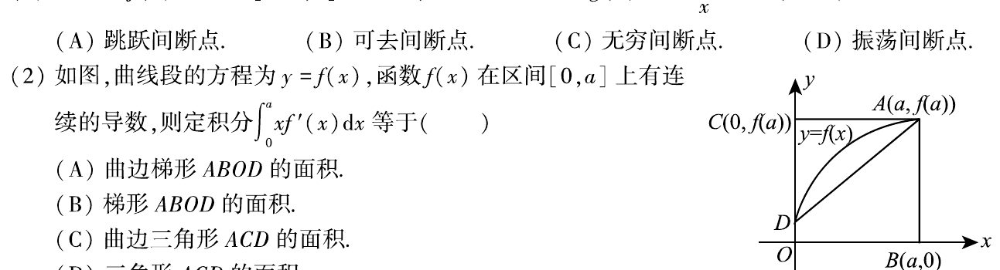

# 2008 数学三第 2 题

## 题目

如图，曲线段的方程为 $y=f(x)$，函数 $f(x)$ 在区间 $[0,a]$ 上有连续的导数，
则定积分
$$
\int_0^a x f'(x)\,dx
$$
等于（ ）。

（A）曲边梯形 $ABOD$ 的面积。

（B）梯形 $ABOD$ 的面积。

（C）曲边三角形 $ACD$ 的面积。

（D）三角形 $ACD$ 的面积。

## 标准答案

C

## 解析

分部积分得
$$
\int_0^a x f'(x)\,dx
=[xf(x)]_0^a-\int_0^a f(x)\,dx
=af(a)-\int_0^a f(x)\,dx.
$$
其中 $af(a)$ 是矩形 $ABOC$ 的面积，$\int_0^a f(x)\,dx$ 是曲边梯形 $ABOD$ 的面积，
二者之差正是曲边三角形 $ACD$ 的面积，所以选 C。

## 来源

- 题目来源: `math3_2008_questions.md`
- 答案解析来源: `math3_2008_answers.md`
