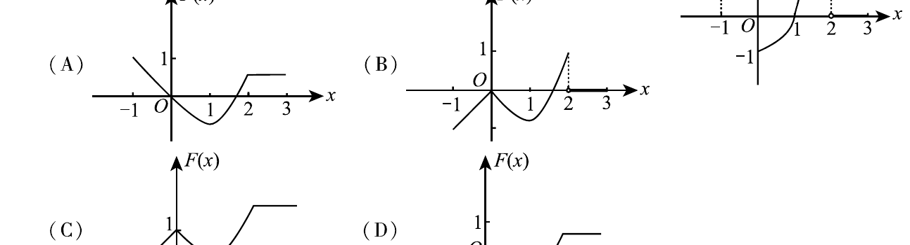

# 2009 数学三第 4 题
## 题目

设函数 $y=f(x)$ 在区间 $\left[-1,3\right]$ 上的图形以及备选图形如下图所示：

则函数 $F(x)=\int_0^x f(t)\,dt$ 的图形为

## 标准答案

D

## 解析

由 $F'(x)=f(x)$ 且 $F(0)=0$，可直接根据题图判断 $F$ 的单调性与形状：

1. 在 $[-1,0]$ 上，$f(x)>0$，所以 $F(x)$ 单调递增；但因为
   $$
   F(x)=\int_0^x f(t)\,dt=-\int_x^0 f(t)\,dt<0,
   $$
   因此图像位于 $x$ 轴下方并向上升到原点。
2. 在 $(0,1)$ 上，$f(x)<0$，故 $F(x)$ 继续减小。
3. 在 $(1,2)$ 上，$f(x)>0$，故 $F(x)$ 转为增大。
4. 在 $[2,3]$ 上，$f(x)=0$，所以 $F(x)$ 保持常数。

同时 $F(x)$ 必连续，因此只有 D 与这些特征完全一致。

## 来源

- 题目来源：2009 年数学三试卷题面与本目录现有题卡、整体题目文件核对后整理。
- 答案解析来源：结合 `Math3Solution.pdf`、`2009P3.tex` 与现有答案文本逐题复核后整理。
