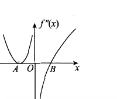

# 2015 数学三第 2 题

## 题目

设函数 $f(x)$ 在 $(-\infty,+\infty)$ 内连续，其二阶导数 $f''(x)$ 的图形如下图所示，则曲线 $y=f(x)$ 的拐点个数为（ ）

A. $0$  
B. $1$  
C. $2$  
D. $3$

## 标准答案

C

## 解析

由于 $f(x)$ 连续，拐点只能出现在 $f''(x)=0$ 或 $f''(x)$ 不存在且其符号发生变化的地方。

从图像可看出，在点 $A$ 左右两侧 $f''(x)>0$，故 $A$ 不是拐点对应位置；而在 $x=0$ 与 $x=B$ 附近，$f''(x)$ 的符号发生变化，因此对应两处拐点。

故曲线 $y=f(x)$ 有 $2$ 个拐点，选 C。

## 来源

- 题目来源：`math3_2015_questions.md`
- 答案来源：`math3_2015_answers.md`
