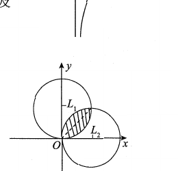

# 2015 数学三第 3 题

## 题目

设
$$
D=\{(x,y)\mid x^2+y^2\le2x,\ x^2+y^2\le2y\},
$$
函数 $f(x,y)$ 在 $D$ 上连续，则
$$
\iint_D f(x,y)\,dxdy
$$
等于（ ）

A. $\displaystyle \int_0^{\pi/4}d\theta\int_0^{2\cos\theta}f(r\cos\theta,r\sin\theta)\,rdr+\int_{\pi/4}^{\pi/2}d\theta\int_0^{2\sin\theta}f(r\cos\theta,r\sin\theta)\,rdr$  
B. $\displaystyle \int_0^{\pi/4}d\theta\int_0^{2\sin\theta}f(r\cos\theta,r\sin\theta)\,rdr+\int_{\pi/4}^{\pi/2}d\theta\int_0^{2\cos\theta}f(r\cos\theta,r\sin\theta)\,rdr$  
C. $\displaystyle 2\int_0^1dx\int_{1-\sqrt{1-x^2}}^x f(x,y)\,dy$  
D. $\displaystyle 2\int_0^1dx\int_x^{\sqrt{2x-x^2}} f(x,y)\,dy$

## 标准答案

B

## 解析

圆 $x^2+y^2=2x$ 化为极坐标是
$$
r=2\cos\theta,
$$
圆 $x^2+y^2=2y$ 化为极坐标是
$$
r=2\sin\theta.
$$
因此公共区域在 $0\le\theta\le\pi/2$ 内，其中
$$
0\le\theta\le\frac\pi4
$$
时上界取 $2\sin\theta$，
$$
\frac\pi4\le\theta\le\frac\pi2
$$
时上界取 $2\cos\theta$。

故正确表达式为 B。

## 来源

- 题目来源：`math3_2015_questions.md`
- 答案来源：`math3_2015_answers.md`
