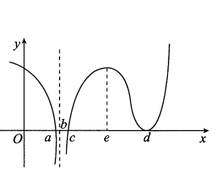

# 2016 数学三第 1 题

## 题目

设函数 $f(x)$ 在 $(-\infty,+\infty)$ 内连续，其导函数的图形如图所示，则（ ）

A. 函数 $f(x)$ 有 $2$ 个极值点，曲线 $y=f(x)$ 有 $2$ 个拐点  
B. 函数 $f(x)$ 有 $2$ 个极值点，曲线 $y=f(x)$ 有 $3$ 个拐点  
C. 函数 $f(x)$ 有 $3$ 个极值点，曲线 $y=f(x)$ 有 $1$ 个拐点  
D. 函数 $f(x)$ 有 $3$ 个极值点，曲线 $y=f(x)$ 有 $2$ 个拐点

## 标准答案

B

## 解析

由导函数 $f'(x)$ 的图形可知，$f'(x)=0$ 的点中，只有在 $x=a,\ x=c$ 处导数符号发生改变，因此 $f(x)$ 只有 $2$ 个极值点。

再看 $f'(x)$ 的单调性：在 $x=b$ 附近，$f'(x)$ 先减后增，因此 $f''(x)$ 变号，$(b,f(b))$ 为拐点；类似地，在 $x=e$ 与 $x=d$ 处，$f'(x)$ 的单调性也发生变化，所以对应地还有两个拐点。

因此曲线 $y=f(x)$ 有 $3$ 个拐点，选 B。

## 来源

- 题目来源：`math3_2016_questions.md`
- 答案来源：`math3_2016_answers.md`
