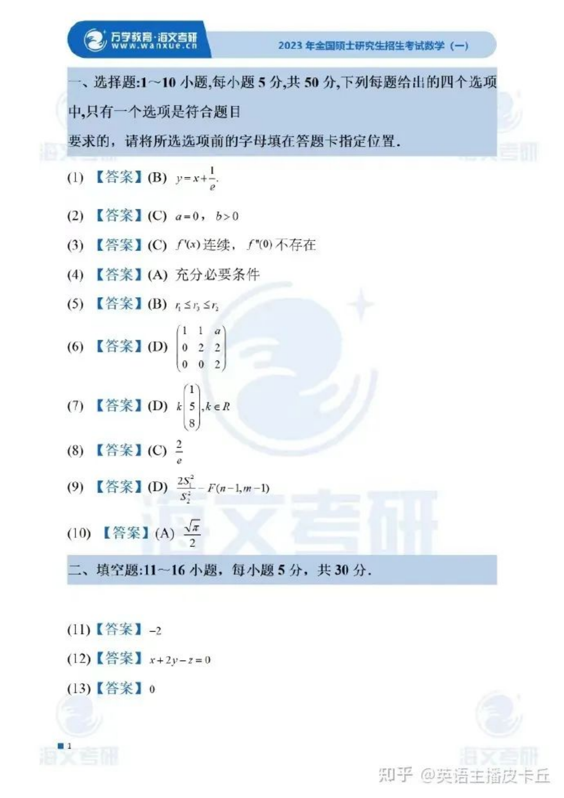
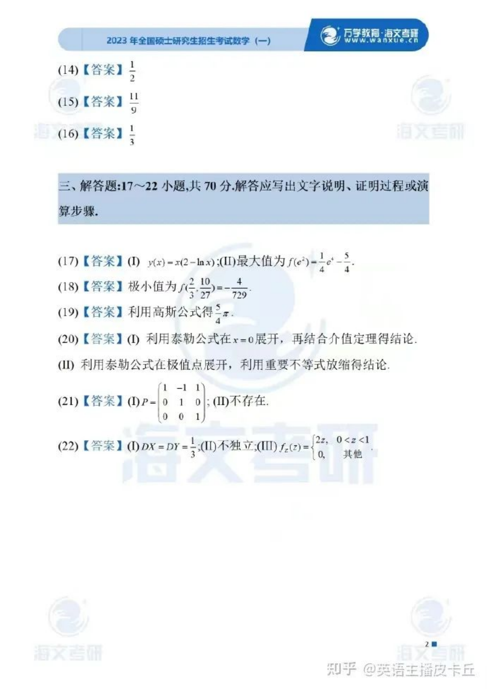
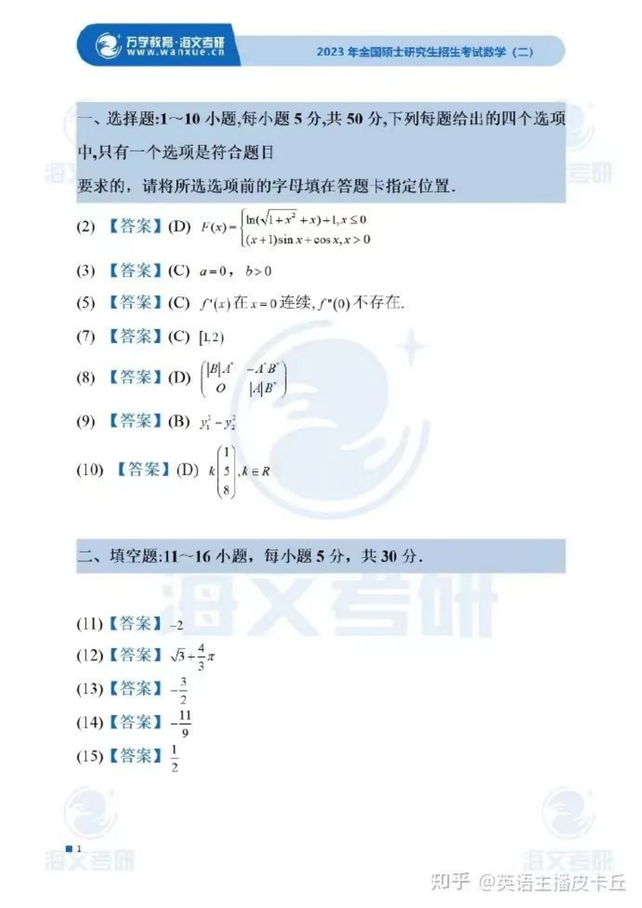
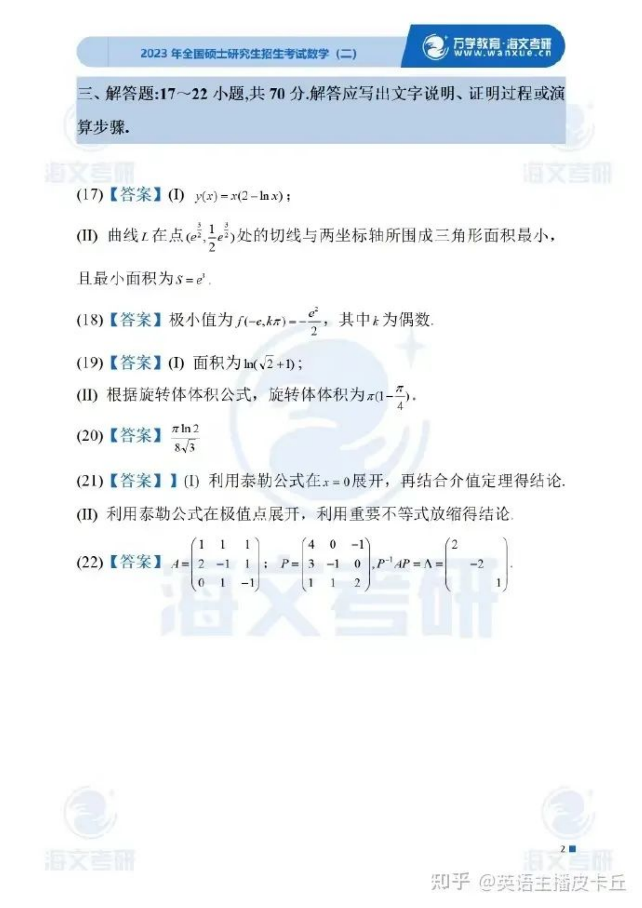
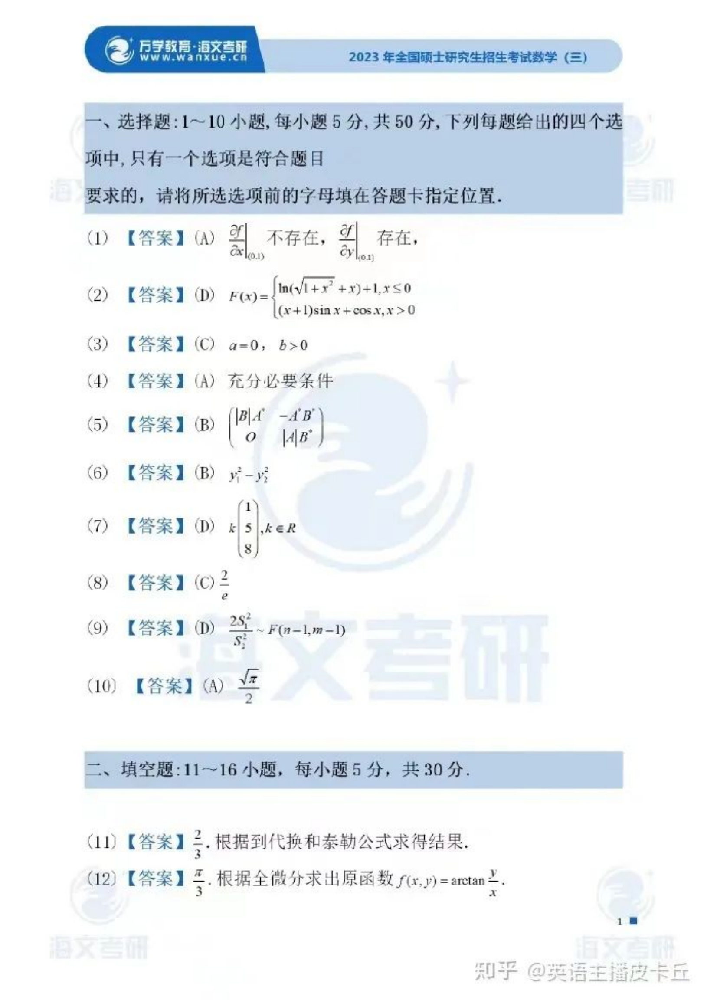
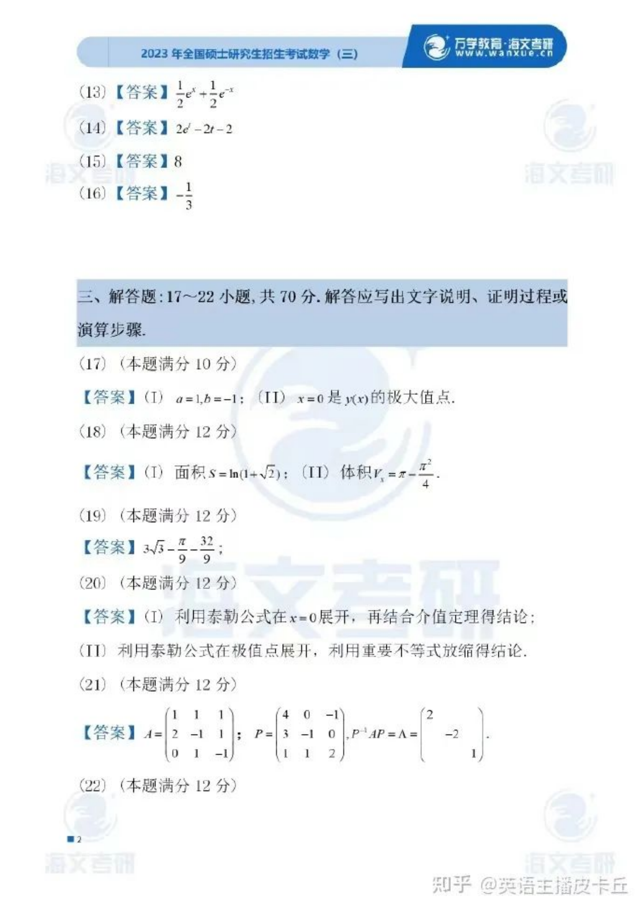

# 2023 年考研数学三答案与解析

> 当前版本保留答案解析 PDF 页图，后续需逐题文本精修。

## 答案解析页图合集

## 第 1 题

### 标准答案

见上方答案解析页图合集；本题待文本精修。

### 解析

本题当前为 PDF 视觉落库版，尚未完成纯文本 LaTeX 转写；答案与解析需结合上方答案解析页图合集继续核对整理。

## 第 2 题

### 标准答案

见上方答案解析页图合集；本题待文本精修。

### 解析

本题当前为 PDF 视觉落库版，尚未完成纯文本 LaTeX 转写；答案与解析需结合上方答案解析页图合集继续核对整理。

## 第 3 题

### 标准答案

见上方答案解析页图合集；本题待文本精修。

### 解析

本题当前为 PDF 视觉落库版，尚未完成纯文本 LaTeX 转写；答案与解析需结合上方答案解析页图合集继续核对整理。

## 第 4 题

### 标准答案

见上方答案解析页图合集；本题待文本精修。

### 解析

本题当前为 PDF 视觉落库版，尚未完成纯文本 LaTeX 转写；答案与解析需结合上方答案解析页图合集继续核对整理。

## 第 5 题

### 标准答案

见上方答案解析页图合集；本题待文本精修。

### 解析

本题当前为 PDF 视觉落库版，尚未完成纯文本 LaTeX 转写；答案与解析需结合上方答案解析页图合集继续核对整理。

## 第 6 题

### 标准答案

见上方答案解析页图合集；本题待文本精修。

### 解析

本题当前为 PDF 视觉落库版，尚未完成纯文本 LaTeX 转写；答案与解析需结合上方答案解析页图合集继续核对整理。

## 第 7 题

### 标准答案

见上方答案解析页图合集；本题待文本精修。

### 解析

本题当前为 PDF 视觉落库版，尚未完成纯文本 LaTeX 转写；答案与解析需结合上方答案解析页图合集继续核对整理。

## 第 8 题

### 标准答案

见上方答案解析页图合集；本题待文本精修。

### 解析

本题当前为 PDF 视觉落库版，尚未完成纯文本 LaTeX 转写；答案与解析需结合上方答案解析页图合集继续核对整理。

## 第 9 题

### 标准答案

见上方答案解析页图合集；本题待文本精修。

### 解析

本题当前为 PDF 视觉落库版，尚未完成纯文本 LaTeX 转写；答案与解析需结合上方答案解析页图合集继续核对整理。

## 第 10 题

### 标准答案

见上方答案解析页图合集；本题待文本精修。

### 解析

本题当前为 PDF 视觉落库版，尚未完成纯文本 LaTeX 转写；答案与解析需结合上方答案解析页图合集继续核对整理。

## 第 11 题

### 标准答案

见上方答案解析页图合集；本题待文本精修。

### 解析

本题当前为 PDF 视觉落库版，尚未完成纯文本 LaTeX 转写；答案与解析需结合上方答案解析页图合集继续核对整理。

## 第 12 题

### 标准答案

见上方答案解析页图合集；本题待文本精修。

### 解析

本题当前为 PDF 视觉落库版，尚未完成纯文本 LaTeX 转写；答案与解析需结合上方答案解析页图合集继续核对整理。

## 第 13 题

### 标准答案

见上方答案解析页图合集；本题待文本精修。

### 解析

本题当前为 PDF 视觉落库版，尚未完成纯文本 LaTeX 转写；答案与解析需结合上方答案解析页图合集继续核对整理。

## 第 14 题

### 标准答案

见上方答案解析页图合集；本题待文本精修。

### 解析

本题当前为 PDF 视觉落库版，尚未完成纯文本 LaTeX 转写；答案与解析需结合上方答案解析页图合集继续核对整理。

## 第 15 题

### 标准答案

见上方答案解析页图合集；本题待文本精修。

### 解析

本题当前为 PDF 视觉落库版，尚未完成纯文本 LaTeX 转写；答案与解析需结合上方答案解析页图合集继续核对整理。

## 第 16 题

### 标准答案

见上方答案解析页图合集；本题待文本精修。

### 解析

本题当前为 PDF 视觉落库版，尚未完成纯文本 LaTeX 转写；答案与解析需结合上方答案解析页图合集继续核对整理。

## 第 17 题

### 标准答案

见上方答案解析页图合集；本题待文本精修。

### 解析

本题当前为 PDF 视觉落库版，尚未完成纯文本 LaTeX 转写；答案与解析需结合上方答案解析页图合集继续核对整理。

## 第 18 题

### 标准答案

见上方答案解析页图合集；本题待文本精修。

### 解析

本题当前为 PDF 视觉落库版，尚未完成纯文本 LaTeX 转写；答案与解析需结合上方答案解析页图合集继续核对整理。

## 第 19 题

### 标准答案

见上方答案解析页图合集；本题待文本精修。

### 解析

本题当前为 PDF 视觉落库版，尚未完成纯文本 LaTeX 转写；答案与解析需结合上方答案解析页图合集继续核对整理。

## 第 20 题

### 标准答案

见上方答案解析页图合集；本题待文本精修。

### 解析

本题当前为 PDF 视觉落库版，尚未完成纯文本 LaTeX 转写；答案与解析需结合上方答案解析页图合集继续核对整理。

## 第 21 题

### 标准答案

见上方答案解析页图合集；本题待文本精修。

### 解析

本题当前为 PDF 视觉落库版，尚未完成纯文本 LaTeX 转写；答案与解析需结合上方答案解析页图合集继续核对整理。

## 第 22 题

### 标准答案

见上方答案解析页图合集；本题待文本精修。

### 解析

本题当前为 PDF 视觉落库版，尚未完成纯文本 LaTeX 转写；答案与解析需结合上方答案解析页图合集继续核对整理。
