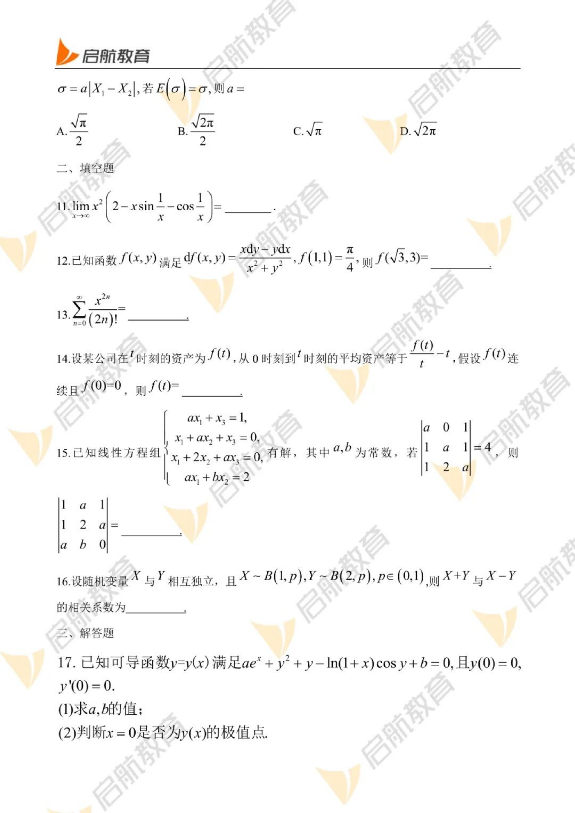

# 2023 数学三第 14 题

## 题目

> 注：当前使用完整原卷页，避免自动裁切遗漏题干；后续可继续逐题文本化。

## 标准答案

见答案解析来源页图；本题待文本精修。

## 解析

本题当前按 PDF 页面视觉方式录入，未使用 PDF 乱码文本层。答案和解析来源为同年答案解析 PDF 页面图，后续需要继续清洗为纯文本 LaTeX 解析。

答案解析页图：

- [page-1](../images/answer_pages/page-1.png)
- [page-2](../images/answer_pages/page-2.png)
- [page-3](../images/answer_pages/page-3.png)
- [page-4](../images/answer_pages/page-4.png)
- [page-5](../images/answer_pages/page-5.png)
- [page-6](../images/answer_pages/page-6.png)

## 来源

- 题目来源：2023 年考研数学三真题 PDF
- 答案解析来源：2023 年考研数学三答案解析 PDF
